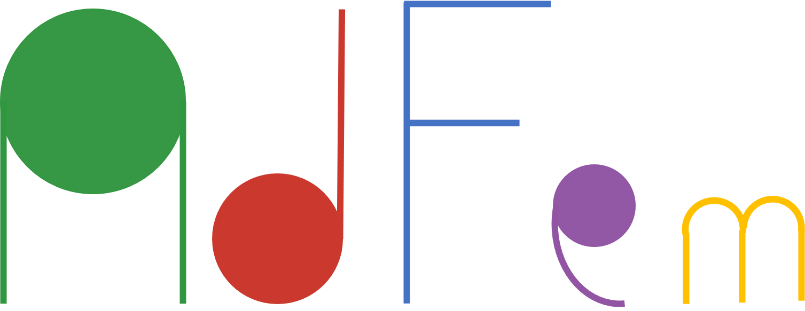

# AdFem





| Documentation                                                |
| ------------------------------------------------------------ |
| [](https://kailaix.github.io/PoreFlow.jl/dev/) |

AdFem is a finite element method open source library for inverse modeling in computational and mathematical engineering. It provides a set of reusable, flexible, and differentiable operators for building scalable and efficient simulators for partial differential equations. 

AdFem is built on [ADCME](https://github.com/kailaix/ADCME.jl), an automatic differentiation library for computational and mathematical engineering. It was originally developed for prototyping inverse modeling algorithms using structured meshes but later evolved into a general and powerful tool with a scalable FEM backend [MFEM](https://mfem.org/). 

`Ad` in AdFem stands for "automatic differentiation" or "adjoint". 

## Forward Computation in AdFem

As an example, we consider solving the Poisson's equation in AdFem


Here


The weak form for the Poisson's equation is to solve a variational equation 


The problem is easily translated in AdFem:

```julia
using PoreFlow
using PyPlot 

# forward computation
mmesh = Meh(joinpath(PDATA, "twoholes_large.stl"))
xy = gauss_nodes(mmesh)
κ = @. sin(xy[:,1]) * (1+xy[:,2]^2) + 1.0
f = 1e5 * @. xy[:,1] + xy[:,2]
K = compute_fem_laplace_matrix1(κ, mmesh)
F = compute_fem_source_term1(f, mmesh)
bdnode = bcnode(mmesh)
K, F = impose_Dirichlet_boundary_conditions(K, F, bdnode, zeros(length(bdnode)))
sol = K\F
```


The above code shows how to use a linear finite element space to approximate the state variable on a given mesh, define boundary conditions, and construct the linear system. 

## Inverse Modeling

