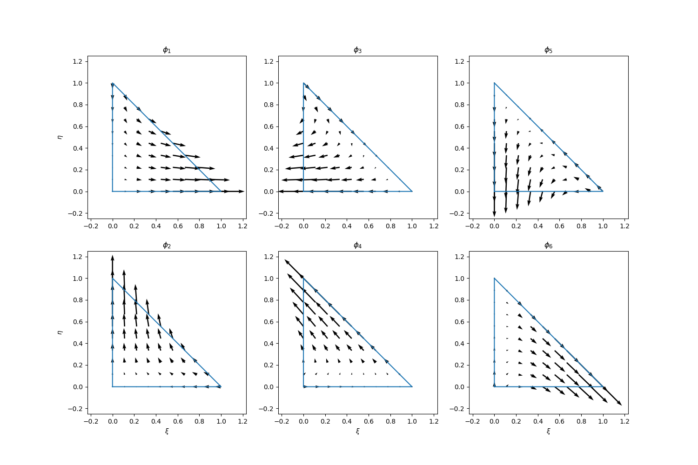
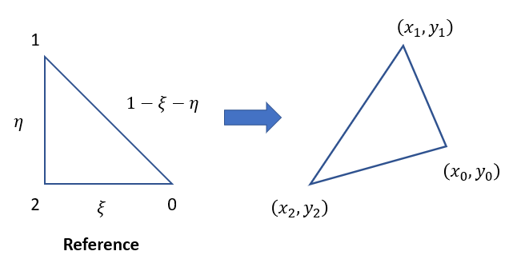

# BDM Finite Element

## Introduction

The Brezzi-Douglas-Marini (BDM) finite elements have been used to approximate $H(\text{div})$ space, which is used in applications such as linear elasticity and magnetism. In this note, we consider the approximation spaces on a trinagulation of a domain in $\mathbb{R}^2$. Particularly, we consider the BDM${}_1$ space. 

BDM elements are approximation to vector spaces (in our case, 2D space). The degrees of freedoms of BDM elements are not associated with vertices because they are not nodal basis functions. To describe the basis functions for BDM${}_1$, we consider the following **edge functions**

$$\begin{aligned}\mathbf{e}_1(s_1, s_2) &= \frac{\sqrt{2}}{s_2-s_1}\begin{bmatrix}s_2\xi\\ (s_2-1)\eta\end{bmatrix}\\\mathbf{e}_2(s_1, s_2) &= \frac{1}{s_2-s_1}\begin{bmatrix}s_2\xi +\eta-s_2\\ (s_2-1)\eta\end{bmatrix}\\\mathbf{e}_3(s_1, s_2) &= \frac{1}{s_2-s_1}\begin{bmatrix}(s_2-1)\xi\\ \xi + s_2\eta - s_2\end{bmatrix}\end{aligned}$$

Let $g_1 = \frac12 - \frac{\sqrt{3}}{6}, g_2 = \frac12 + \frac{\sqrt{3}}{6}$ be the two Gaussian quadrature points on the interval $[0,1]$, the basis functions (defined in a counter clockwise orientation) are 
$$\begin{aligned}\phi_1(\xi, \eta) &= \mathbf{e}_1(g_1, g_2) & \phi_2(\xi, \eta) &= \mathbf{e}_1(g_2, g_1)\\\phi_3(\xi, \eta) &= \mathbf{e}_2(g_1, g_2) & \phi_4(\xi, \eta) &= \mathbf{e}_2(g_2, g_1)\\\phi_5(\xi, \eta) &= \mathbf{e}_3(g_1, g_2) & \phi_6(\xi, \eta) &= \mathbf{e}_3(g_2, g_1)\end{aligned}$$

The six basis functions can be visualized as follows (codes are [here](./snippets/BDM)):

In the finite element calculation, we need to map the reference triangle to the physical one. 

The relations are given by 

$$\begin{aligned}x= (x_1-x_2)\xi + (x_0 - x_2)\eta + x_2\\ y= (y_1-y_2)\xi + (y_0 - y_2)\eta + y_2\end{aligned}$$

Therefore,

$$\begin{aligned}\xi =\frac1J \left[(y_0-y_2)(x-x_2)+(x_2-x_0)(y-y_2)\right]\\ \eta =\frac1J \left[(y_2-y_1)(x-x_2)+(x_1-x_2)(y-y_2)\right]\end{aligned}$$

where $J = (x_1-x_2)(y_0-y_2) - (x_0-x_2)(y_1-y_2)$. Thus we have

$$\text{div}\xi = \frac{y_0-y_2 + x_2-x_0}{J},\quad \text{div}\eta = \frac{y_2-y_1+x_1-x_2}{J}$$

This helps us to derive the divergence of the basis functions in the physical space:

$$\text{div}\tilde \phi_i(x, y) = \begin{bmatrix} \frac{\partial \phi_{i1}}{\partial \xi}& \frac{\partial \phi_{i2}}{\partial \eta}\end{bmatrix}\begin{bmatrix} \text{div}\xi\\ \text{div}\eta\end{bmatrix}$$

## Applications