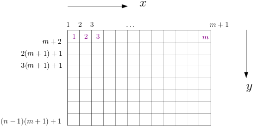
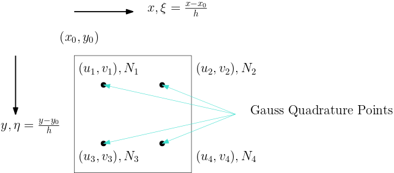

# Coupled Geomechanics and Multiphase Flow

## Mathematical Formulation

The governing equation for mechanical deformation of the solid-fluid system is 

$$\boxed{\mathrm{div} \sigma + \rho_b g = 0}$$

where $\mathrm{div}$ is the divergence operator, $\sigma$ is the Cauchy total-stress 

$$\sigma = \begin{bmatrix}
\sigma_{xx} & \sigma_{xy}\\
\sigma_{xy} & \sigma_{yy}
\end{bmatrix}$$

and $g\in\mathbb{R}^2$ is the gravity vector, $\rho_b=\phi \rho_f + (1-\phi)\rho_s$  is the bulk density, $\rho_f$ is total fluid density, $\rho_s$ is the density of the solid phase and $\phi$ is the true porosity. 

The stress-strain relation for linear poroelasticity takes the form 

$$\sigma = \sigma' - bp\mathbf{I},\quad \sigma' = \begin{bmatrix}
\sigma'_{xx} & \sigma'_{xy}\\
\sigma'_{xy} & \sigma'_{yy}
\end{bmatrix},
\quad\begin{bmatrix}
\delta\sigma'_{xx}\\\delta\sigma'_{yy}\\\delta\sigma'_{xy}
\end{bmatrix} = D\begin{bmatrix}
\delta\varepsilon_{xx}\\\delta\varepsilon_{yy}\\2\delta\varepsilon_{xy}
\end{bmatrix}$$

where $\mathbf{I}$ is the identity matrix, $p$ is the pressure, $b$ is the Biot coefficient, $D$ is the elasticity matrix

$$D = \frac{E(1-\nu)}{(1+\nu)(1-2\nu)}\begin{bmatrix}
1 & \frac{\nu}{1-\nu}& \frac{\nu}{1-\nu}\\
\frac{\nu}{1-\nu} & 1 & \frac{\nu}{1-\nu}\\
\frac{\nu}{1-\nu} & \frac{\nu}{1-\nu} & 1
\end{bmatrix}$$

$E$ is the Young modulus,  $\nu$ is the Poisson ratio and  $\varepsilon$ is the strain

$$\varepsilon = \begin{bmatrix}
\varepsilon_{xx} & \varepsilon_{xy}\\
\varepsilon_{xy} & \varepsilon_{yy}
\end{bmatrix}$$

!!! info
    The relation between $\sigma'$ and $\varepsilon$ may be nonlinear; that's why we only write $\delta \sigma'$ in terms of $\delta \varepsilon$. 

The fluid mass convervation in terms of pressure and volumetric strain is given by 

$$\boxed{\frac{1}{M}\frac{\partial p}{\partial t} + b\frac{\partial \varepsilon_v}{\partial t} + \mathrm{div}\mathrm{v} = f}$$

where $\varepsilon_v = \mathrm{tr} \varepsilon$, $f$ is a volumetric source term and 

$$\mathbf{v} = -\frac{1}{B_f}\frac{k}{\mu}(\nabla p - \rho_f g)$$

where $k$ is the absolute permeability tensor, $\mu$ is the fluid viscosity and $B_f$ is the formation volume factor of the fluid. 

The mechanical equation and fluid equation are coupled through $p$ and $\varepsilon$. In the drained split scheme, in each step $p$ is kept fixed while solving the mechanics equation and then the fluid equation is solved keeping $\varepsilon$ fixed. The drained scheme can be viewed as a Jacobian iteration of the fully coupled system. 

## Numerical Discretization

### Mechanics

We discretize the domain $[0,(n-1)h]\times [0, (m-1)h]$ uniformly with step size $h$.

The finite element method is usually used to solve the mechanics equation, whose discretization reads

$$\int_{\Omega} \delta \varepsilon :\sigma'\mathrm{d}x - \int_\Omega b p \delta \varepsilon_v\mathrm{d}x = \int_{\Gamma} t\cdot\delta u\mathrm{d}s + \int_\Omega \rho_b g\cdot\delta u dx$$

where $t = \sigma n = \sigma' n - bpn$, $\Gamma$ is the part of $\partial \Omega$ with external traction,  and $n$ is the unit normal vector pointing outwards. One each element $A$, define $u_A$ as the nodal values of the basis functions whose supports overlap $A$, then the strain at $(x,y)$ can be expressed as (see the figure for illustration)

$$\varepsilon_A = Bu_A, \quad \varepsilon_A =\begin{bmatrix}
\varepsilon_{xx}\\
\varepsilon_{yy}\\
2\varepsilon_{xy}
\end{bmatrix},\quad
u_A = \begin{bmatrix}
u_1\\
u_2\\
u_3\\
u_4\\
v_1\\
v_2\\
v_3\\
v_4
\end{bmatrix}$$

where 

$$B = \begin{bmatrix}
\frac{\partial N_1}{\partial x} & \frac{\partial N_2}{\partial x} & \frac{\partial N_3}{\partial x} & \frac{\partial N_4}{\partial x} & 0 & 0 & 0 & 0\\
0 & 0 & 0 & 0 & \frac{\partial N_1}{\partial y} & \frac{\partial N_2}{\partial y} & \frac{\partial N_3}{\partial y} & \frac{\partial N_4}{\partial y}\\
\frac{\partial N_1}{\partial y} & \frac{\partial N_2}{\partial y} & \frac{\partial N_3}{\partial y} & \frac{\partial N_4}{\partial y} & \frac{\partial N_1}{\partial x} & \frac{\partial N_2}{\partial x} & \frac{\partial N_3}{\partial x} & \frac{\partial N_4}{\partial x}
\end{bmatrix} = \begin{bmatrix}
-\frac{1-\eta}{h}&\frac{1-\eta}{h} &-\frac{\eta}{h} & \frac{\eta}{h} & 0 & 0 & 0 & 0\\
0 & 0 & 0 & 0 & -\frac{1-\xi}{h} & -\frac{\xi}{h} & \frac{1-\xi}{h} & \frac{\xi}{h}\\
-\frac{1-\xi}{h} & -\frac{\xi}{h} & \frac{1-\xi}{h} & \frac{\xi}{h} & -\frac{1-\eta}{h}&\frac{1-\eta}{h} &-\frac{\eta}{h} & \frac{\eta}{h}
\end{bmatrix}$$

and

$$\xi = \frac{x-x_0}{h}\quad \eta = \frac{y-y_0}{h}$$

The terms in the weak form can be expressed as 

$$\int_{A}\delta \varepsilon :\sigma'\mathrm{d}x = \int_A u_AB^TDB\delta u_A\mathrm{d}x$$

$$\int_A b p \delta \varepsilon_v\mathrm{d}x = \int_A bp [1,1,0]B^T\delta u_A\mathrm{d}x$$

Typically, the integration is computed using Gauss quadrature; for example, we have

$$\int_A u_AB^TDB\delta u_A\mathrm{d}x = u_A \left[\sum_{i=1}^{n_g} B(\xi_i, \eta_i)^T DB(\xi_i, \eta_i)h^2w_i\right]\delta u_A$$

where $(x_i, \eta_i)$ are Gauss quadrature points and $w_i$ is the corresponding weight. 

### Fluid

The fluid equation is discretized using finite volume method. 

$$\int_{A_i} \frac{1}{M}\frac{p_i^{n+1} - p_{i}^{n}}{\Delta t} \mathrm{d}x + \int_{A_i} b \frac{\varepsilon_v^{n+1}-\varepsilon_v^n}{\Delta t} \mathrm{d} x + \int_{A_i} \mathrm{div}\mathbf{v}\mathrm{d}x = \int_{A_i} f\mathrm{d}x$$

For the divergence term, we use the two-point flux approximation and we have (assuming $k$ is a constant scalar)

$$\int_{A_i} \mathrm{div}\mathbf{v} \mathrm{d}x = -\frac{k}{B_f\mu}\sum_{j=1}^{n_{\mathrm{faces}}} (q_j-q_i) = -\frac{k}{B_f\mu}\sum_{j=1}^{n_{\mathrm{faces}}} (p_j^{n+1} - p_i^{n+1}) + \frac{k\rho_f|g|}{B_f\mu}\sum_{j=1}^{n_\mathrm{faces}} y_j$$

where
$$q = p^{n+1} - \rho_f|g|y$$

### Initial and Boundary Conditions

For the mechanial problem we consider

* Prescribed displacement: $u = \bar u$; or
* Prescribed traction: $\sigma\cdot n=\bar t$ (also called *overburden*).

For the flow problem we consider

* Prescribed pressure: $p=\bar p$; or
* Prescribed volumetric flux: $\mathbf{v}\cdot n=\bar v$ (called *no flow* if $\bar v=0$).

The initial displacement and strains are zero. The initial pressure is prescribed. 

### Numerical Example

Here is a list of reasonable parameters

| Property               | Value                          |
| ---------------------- | ------------------------------ |
| Permeability $k$       | 50 md                          |
| Biot coefficient $b$   | 1.0                            |
| Bulk density $\rho_b$  | 2400 kg/m${}^3$                |
| Fluid viscosity $\mu$  | $8.9\times 10^{-4}$ Pa$\cdot$s |
| Grid spacing $h$       | 2 m                            |
| Fluid density $\rho_f$ | 1000 kg/m${}^3$                |
| Initial pressure $P_i$ | 2.125 MPa                      |
| Traction $|\bar t|$    | 2.125 MPa                      |
| Young's modulus $E$    | 350 MPa                        |
| Poisson's ratio $\nu$  | 0.35                           |

​                                    

