# Coupled Viscoelasticity and Single Phase Flow 

We have considered [inverse modeling for viscoelasticity](https://kailaix.github.io/PoreFlow.jl/dev/inv_viscoelasticity/) and [coupled elasticity and single phase flow inversion](https://kailaix.github.io/PoreFlow.jl/dev/inverse/). A more complex case is when the constitutive relation is given by the [viscoelasticity](https://kailaix.github.io/PoreFlow.jl/dev/viscoelasticity/) and the dynamics is governed by the coupled viscoelasticity and single phase flow equation. We consider the same governing equation as the [poreelasticity](https://kailaix.github.io/PoreFlow.jl/dev/coupled/)


$$\begin{align}
\mathrm{div}\sigma(u) - b \nabla p &= 0\\
\frac{1}{M} \frac{\partial p}{\partial t} + b\frac{\partial \varepsilon_v(u)}{\partial t} - \nabla\cdot\left(\frac{k}{B_f\mu}\nabla p\right) &= f(x,t)
\end{align}$$


with boundary conditions

$$\begin{aligned}
\sigma n = 0,\quad x\in \Gamma_{N}^u, \qquad u=0, \quad x\in \Gamma_D^u\\
-\frac{k}{B_f\mu}\frac{\partial p}{\partial n} = 0,\quad x\in \Gamma_{N}^p, \qquad p=g, \quad x\in \Gamma_D^p
\end{aligned}$$

and the initial condition

$$p(x,0) = 0,\ u(x,0) =0,\ x\in \Omega$$

The only difference is that the consitutive relation is given by the [Maxwell material equation](https://kailaix.github.io/PoreFlow.jl/dev/viscoelasticity/#Numerical-Example-1), which has the following form in the discretization (for the definition of $H$ and $S$, see [here](https://kailaix.github.io/PoreFlow.jl/dev/viscoelasticity/#Numerical-Example-1))

$$\sigma^{n+1} = H \varepsilon^{n+1} + S \sigma^n  - H\varepsilon^n$$

Then the discretization for the mechanics is 

$$\int_\Omega H \varepsilon^{n+1} : \delta \varepsilon \;\mathrm{d}x- \int_\Omega b p \delta u \;\mathrm{d}x = \int_{\partial \Omega} \mathbf{t}\delta u \;\mathrm{d}s + \int_{\Omega} H\varepsilon^n : \delta\varepsilon \;\mathrm{d} x - \int_\Omega S\sigma^n : \delta \varepsilon \;\mathrm{d} x$$

For the discretization of the fluid equation, see [here](https://kailaix.github.io/PoreFlow.jl/dev/coupled/).

## Forward Simulation

To have an overview of the viscoelasticiy, we conduct the forward simulation in the injection-production model. An injection well is located on the left while a production well is located on the right. We impose the Dirichlet boundary conditions for $u$  and no flow boundary conditions for the pressure on four sides. We run the results with Lamé constants $\lambda=2.0$ and $\mu=0.5$, and three different viscosity $\eta = 10000, 1$, and $0.1$. The case  $\eta = 10000$ corresponds to a nearly linear elastic constitutive relation. The typical characteristics of viscoelasticity in our experiments are that they usually possess larger stresses and smaller displacements. 

| Description                            | $\eta=10000$                                               | $\eta=1$ | $\eta=0.1$ |
| -------------------------------------- | ------------------------------------------------------------ | -------- | --------- |
| Pressure                               |  |          |           |
| $\sigma_{xx}$                          |  |  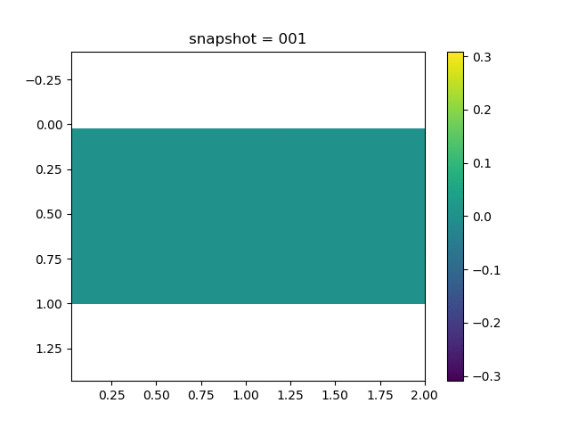        |           |
| $\sigma_{xy}$                          |  |  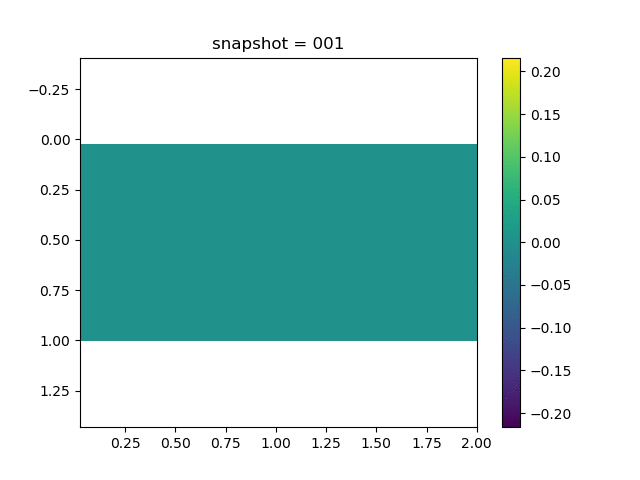        |           |
| $\sigma_{yy}$                          |  |          |           |
| $u$                                    | 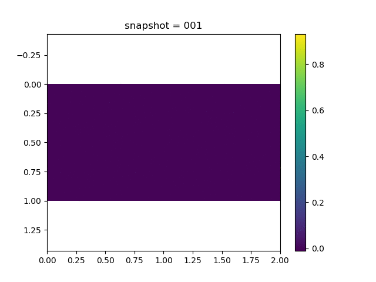 |  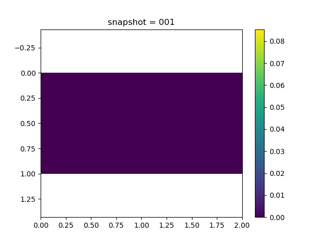        |           |
| $v$                                    |  |          |           |
| $\sigma_{xx}$ at the center point      | 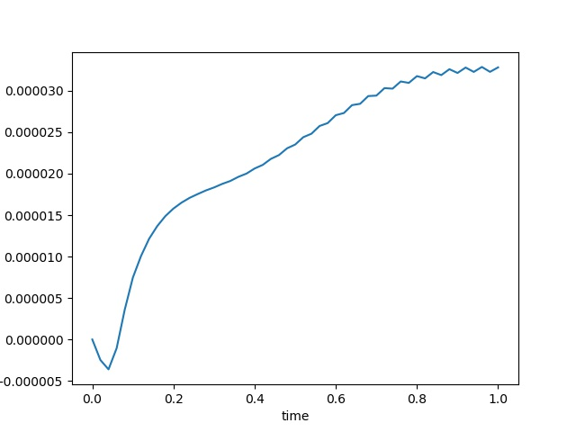 |  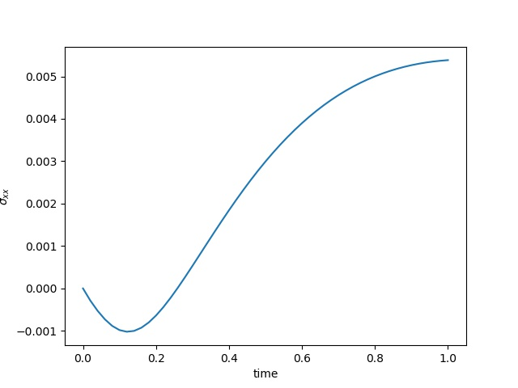     |      |
| $u$ at the center point                | 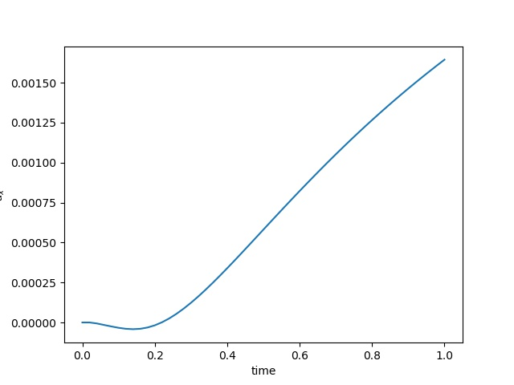 |  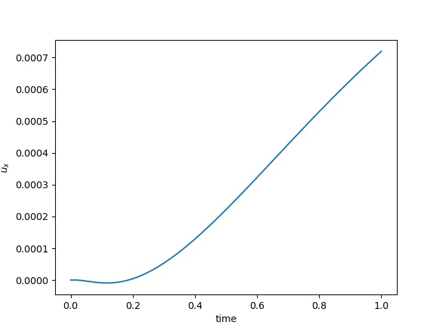      | 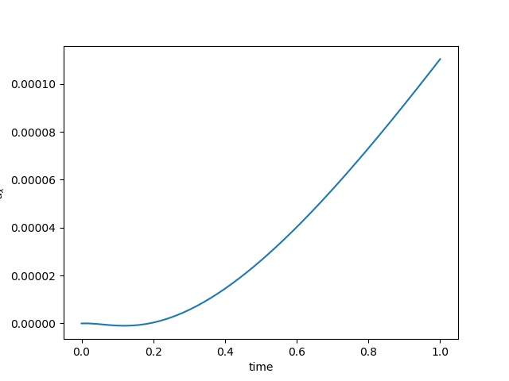      |
| $\varepsilon_{xx}$ at the center point |  |  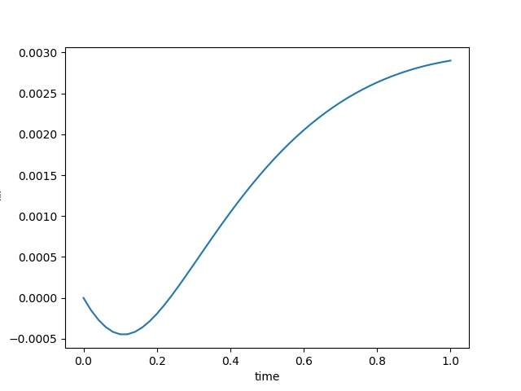      |     |


## Inverse Modeling	

In the inverse modeling, the initial conditions and boundary conditions are 

* $u$, $\sigma$, and $p$ are all initialized to zero. 

* Fixed Dirichlet boundaries for $u$ on the bottom. 
* Traction-free boundary conditions (free surface) for $u$ on the other three sides
* No-flow condition for $p$ on all sides. 

We have 5 sets of training data, each corresponds to a Delta production (injection) source with the magnitude $0.2i$, $i=1,2,3,4$ and 5​. We show a typical dataset below. 

| Pressure                                                     | $\sigma_{xx}$                                                | $\sigma_{yy}$                                                | $\sigma_{xy}$                                                | $u$                                                          | $v$                                                          |
| ------------------------------------------------------------ | ------------------------------------------------------------ | ------------------------------------------------------------ | ------------------------------------------------------------ | ------------------------------------------------------------ | ------------------------------------------------------------ |
|  |  |  | 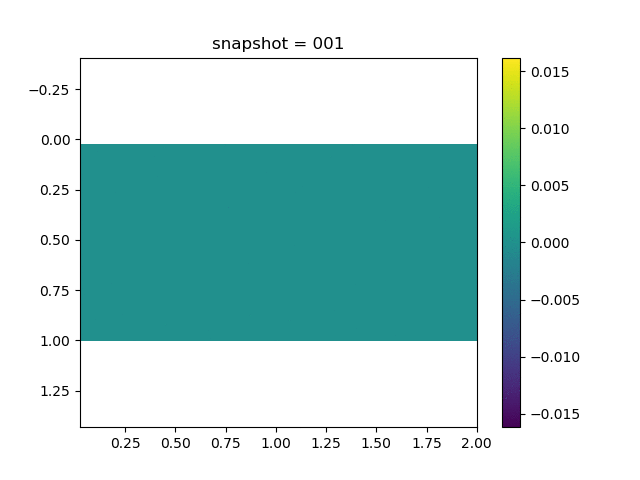 | 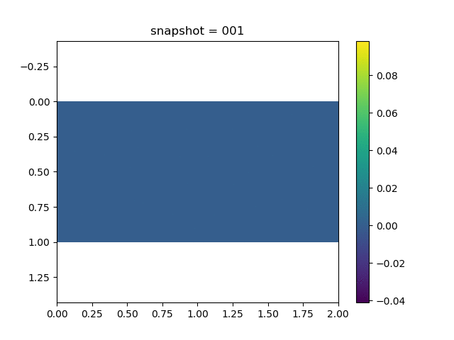 | 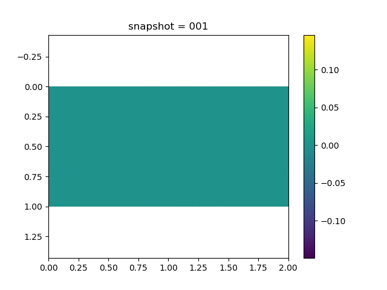 |


| Displacement                                                 | $\sigma_{xx}$ at the center point                            | $\varepsilon_{xx}$  at the center point                      | $u$ at the center point                                      |
| ------------------------------------------------------------ | ------------------------------------------------------------ | ------------------------------------------------------------ | ------------------------------------------------------------ |
| 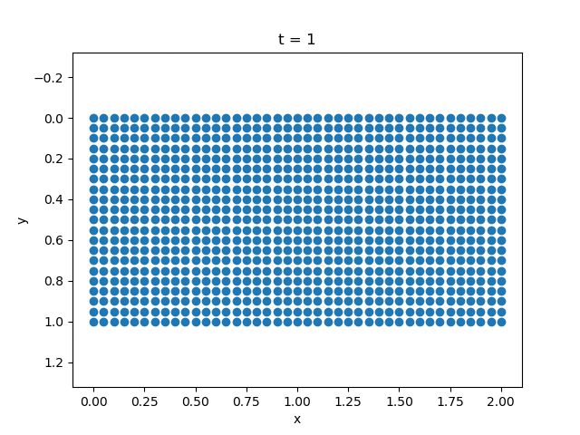 | 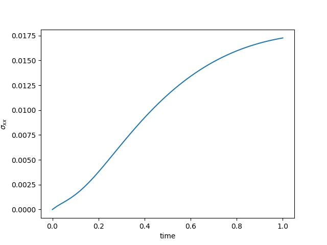 | 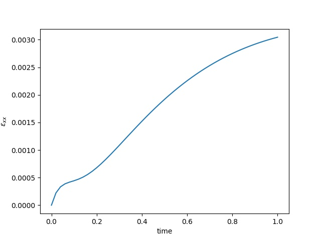 | 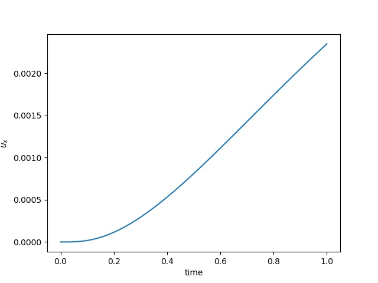 |

The observation data is the $x$-direction displacement at all time steps on the surface. We will consider several kinds of inversion. 

* **Parametric inversion**. In this case, we assume we already know the form of the consitutitve relation and we only need to estimate $\mu$, $\lambda$ and $\eta$. [code](https://github.com/kailaix/PoreFlow.jl/blob/master/research/visco_inverse/coupled_visco_param.jl)

* **Linear elasticity approximation**. In this case, the constitutive relation is assumed to have the linear elasticity form [code](https://github.com/kailaix/PoreFlow.jl/blob/master/research/visco_inverse/coupled_visco_simple.jl)

  $$\sigma = H\varepsilon$$

Here $H$ is an unknown SPD matrix. 

* **Direct inversion**. The constitutive relation is substituted by 

$$\sigma^{n+1} = \mathcal{NN}(\sigma^n, \varepsilon^n)$$

where $\mathcal{NN}$ is a neural network. [code](https://github.com/kailaix/PoreFlow.jl/blob/master/research/visco_inverse/coupled_visco_nn_direct.jl)

* **Implicit inversion**. The constitutive relation is subsituted by 

$$\sigma^{n+1} = \mathcal{NN}(\sigma^n, \varepsilon^n) + H\varepsilon^{n+1}$$

where $\mathcal{NN}$ is a neural network and $H$ is an unknown SPD matrix. The advantage of this form is to improve the conditioning of the implicit numerical scheme.  [code](https://github.com/kailaix/PoreFlow.jl/blob/master/research/visco_inverse/coupled_visco_nn.jl)


To evaluate the inverse modeling result, we consider a test dataset which corresponds to the magnitude 0.5 for the Delta sources. We measure the displacement and Von Mises stress. For the first inversion, we report the values. 


For the **parametric inversion**, we have the following result

|  | 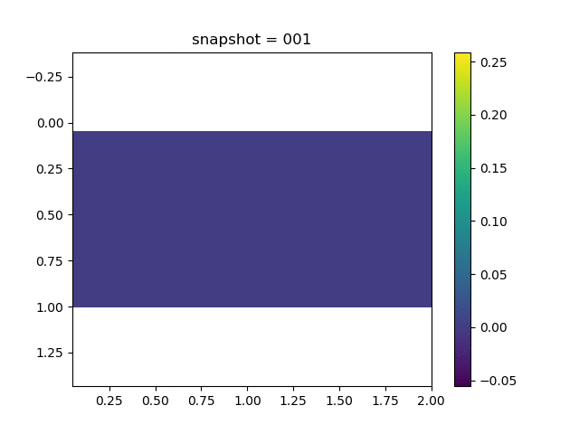 | 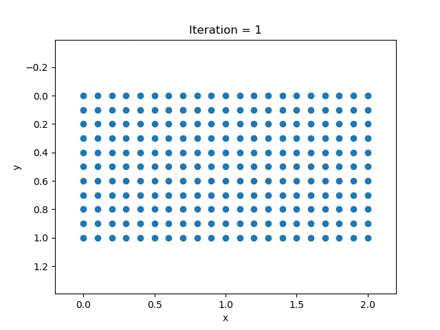 |
| ------------------------------------------------------------ | ------------------------------------------------------------ | ------------------------------------------------------------ |
| Loss Function                                                | Von Mises Stress                                             | Displacement                                                 |


| Parameter | Initial Guess | Estimated           | True |
| --------- | ------------- | ------------------- | ---- |
| $\mu$     | 1.5           | 0.49999986292871396 | 0.5  |
| $\lambda$ | 1.5           | 1.9999997784851993  | 2.0  |
| $\eta$    | 1.5           | 0.9999969780184615  | 1.0  |


For the other three types of inversion, the results are presented below

| Reference                                                    | Linear Elasticity                                            | Direct                                                       | Implicit                                                     |
| ------------------------------------------------------------ | ------------------------------------------------------------ | ------------------------------------------------------------ | ------------------------------------------------------------ |
|  | 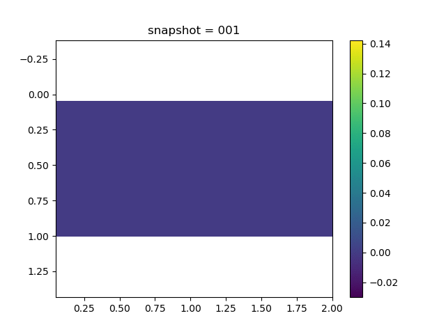 |  | 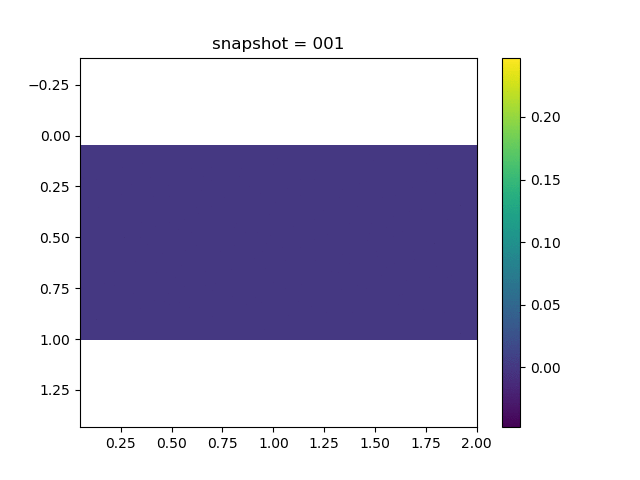 |
|  | 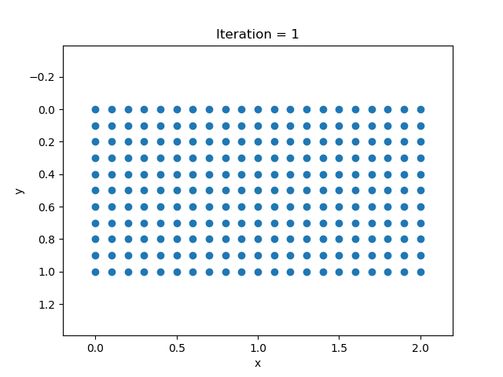 |  |  |


The results are reported at 2000-th iteration. In terms of the Von Mises stress, we see that the direct training gives us the best result (note the scale of the colorbar). 


## Forward Simulation Codes

```julia
using Revise
using PoreFlow
using PyCall
using LinearAlgebra
using ADCME
using MAT
using PyPlot
np = pyimport("numpy")

# Domain information 
NT = 50
Δt = 1/NT
n = 20
m = 2*n 
h = 1.0/n 
bdnode = Int64[]
for i = 1:m+1
    for j = 1:n+1
        if i==1 || i==m+1 || j==1|| j==n+1
            push!(bdnode, (j-1)*(m+1)+i)
        end
    end
end

is_training = false
b = 1.0

invη = 1.0
if length(ARGS)==1
    global invη = parse(Float64, ARGS[1])
end

λ = constant(2.0)
μ = constant(0.5)
invη = constant(invη)

iS = tensor(
    [1+2/3*μ*Δt*invη -1/3*μ*Δt*invη 0.0
    -1/3*μ*Δt*invη 1+2/3*μ*Δt*invη 0.0 
    0.0 0.0 1+μ*Δt*invη]
)
S = inv(iS)
H = S * tensor([
    2μ+λ λ 0.0
    λ 2μ+λ 0.0
    0.0 0.0 μ
])


Q = SparseTensor(compute_fvm_tpfa_matrix(m, n, h))
K = compute_fem_stiffness_matrix(H, m, n, h)
L = SparseTensor(compute_interaction_matrix(m, n, h))
M = SparseTensor(compute_fvm_mass_matrix(m, n, h))
A = [K -b*L'
b*L/Δt 1/Δt*M-Q]
A, Abd = fem_impose_coupled_Dirichlet_boundary_condition(A, bdnode, m, n, h)
# error()
U = zeros(m*n+2(m+1)*(n+1), NT+1)
x = Float64[]; y = Float64[]
for j = 1:n+1
    for i = 1:m+1
        push!(x, (i-1)*h)
        push!(y, (j-1)*h)
    end
end
    
injection = (div(n,2)-1)*m + 3
production = (div(n,2)-1)*m + m-3


function condition(i, tas...)
    i<=NT
end

function body(i, tas...)
    ta_u, ta_ε, ta_σ = tas
    u = read(ta_u, i)
    σ0 = read(ta_σ, i)
    ε0 = read(ta_ε, i)
    rhs1 = compute_fem_viscoelasticity_strain_energy_term(ε0, σ0, S, H, m, n, h)
    rhs2 = zeros(m*n)
    rhs2[injection] += 1.0
    rhs2[production] -= 1.0
    rhs2 += b*L*u[1:2(m+1)*(n+1)]/Δt + 
            M * u[2(m+1)*(n+1)+1:end]/Δt
    rhs = [rhs1;rhs2]
    o = A\rhs 

    ε = eval_strain_on_gauss_pts(o, m, n, h)
    σ = σ0*S + (ε - ε0)*H
    ta_u = write(ta_u, i+1, o)
    ta_ε = write(ta_ε, i+1, ε)
    ta_σ = write(ta_σ, i+1, σ)
    i+1, ta_u, ta_ε, ta_σ
end

i = constant(1, dtype=Int32)
ta_u = TensorArray(NT+1); ta_u = write(ta_u, 1, constant(zeros(2(m+1)*(n+1)+m*n)))
ta_ε = TensorArray(NT+1); ta_ε = write(ta_ε, 1, constant(zeros(4*m*n, 3)))
ta_σ = TensorArray(NT+1); ta_σ = write(ta_σ, 1, constant(zeros(4*m*n, 3)))
_, u_out, ε_out, σ_out = while_loop(condition, body, [i, ta_u, ta_ε, ta_σ])
u_out = stack(u_out)
u_out.set_shape((NT+1, size(u_out,2)))
σ_out = stack(σ_out)
ε_out = stack(ε_out)

upper_idx = Int64[]
for i = 1:m+1
    push!(upper_idx, (div(n,3)-1)*(m+1)+i)
    push!(upper_idx, (div(n,3)-1)*(m+1)+i + (m+1)*(n+1))
end
for i = 1:m 
    push!(upper_idx, (div(n,3)-1)*m+i+2(m+1)*(n+1))
end

sess = Session(); init(sess)
U, Sigma, Varepsilon, ev = run(sess, [u_out,σ_out,ε_out, invη])
visualize_displacement(U'|>Array, m, n, h, name="_visco$ev")
visualize_pressure(U'|>Array, m, n, h, name="_visco$ev")
visualize_scattered_displacement(U'|>Array, m, n, h, name="_visco$ev")
visualize_stress(Sigma[:,:,1]'|>Array, m, n, h, name="xx_visco$ev")
visualize_stress(Sigma[:,:,2]'|>Array, m, n, h, name="yy_visco$ev")
visualize_stress(Sigma[:,:,3]'|>Array, m, n, h, name="xy_visco$ev")


idx = m÷2 + (n÷2)*m
close("all")
plot(LinRange(0,1.0, NT+1),Sigma[:,4*(idx-1)+1,1])
xlabel("time")
ylabel("\$\\sigma_{xx}\$")
savefig("sigmaxx$ev.jpeg")

close("all")
plot(LinRange(0,1.0, NT+1),Varepsilon[:,4*(idx-1)+1,1])
xlabel("time")
ylabel("\$\\varepsilon_{xx}\$")
savefig("varepsilonxx$ev.jpeg")

idx = m÷2 + (n÷2)*(m+1)
close("all")
plot(LinRange(0,1.0, NT+1),U[:,4*(idx-1)+1])
xlabel("time")
ylabel("\$u_x\$")
savefig("ux$ev.jpeg")
```