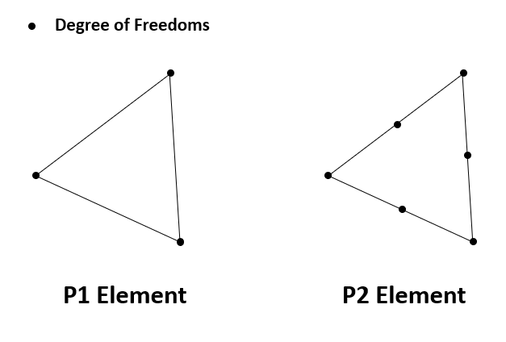
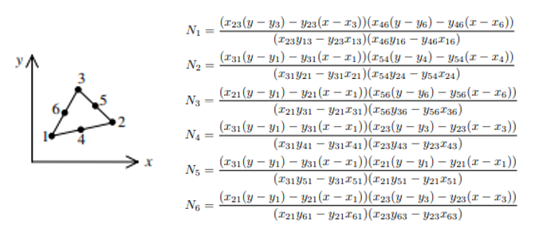
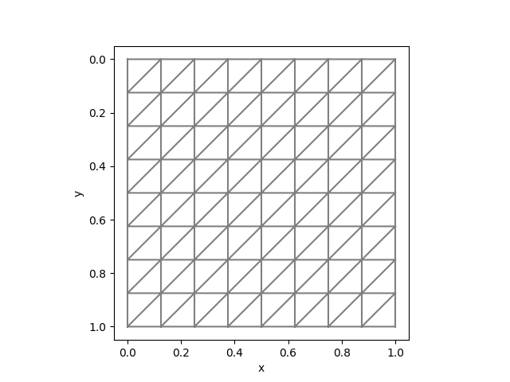
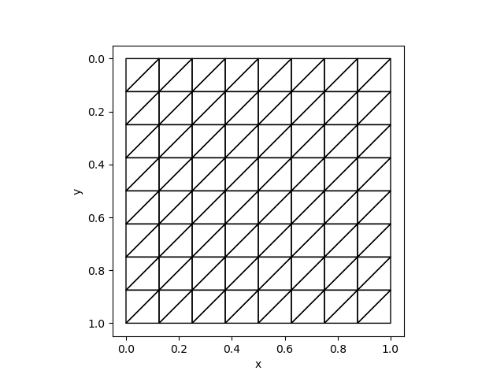

# Adding Custom Operators for Unstructured Meshes

## Workflow
This tutorial describes how to develop custom operators for unstructured meshes. 

AdFem uses [MFEM](https://mfem.org/) as the backend for assembling finite element matrices. However, users, as well as custom operator developers, do not need to know how to use MFEM. AdFem has provided an easier interface to essential data structures for assembling finite element matrices. The data structure can be assessed in C++ (see [`Mesh`](@ref)) and the header files are located in `deps/MFEM/Common.h`. As the structured mesh utilties, we do not expose the APIs for Julia users, and therefore if some operators are lacking, users must modify the source codes of AdFem. 

The basic workflow is to go into `deps/MFEM` directory. Then 

1. Make a new directory to add all source codes related to your custom operator.
2. Generate templated files using `customop`. 
3. In your source code, do remember to include `../Common.h`, which exposes `mmesh` for all necessary data structures. 
4. Add your source code file names to `deps/MFEM/CMakeLists.txt`.
5. Recompile AdFem or run `ninja` in `deps/MFEM/build`. 
6. Test your code. Note you need to replace the library path in `load_op_and_grad` by `AdFem.libmfem` in order to share the same `mmesh` throughout the session. 

## Assembling Matrices and Vectors

The main approach for assembling matrices and vectors in finite element methods is to loop over each element (triangles in our case), and computes contributions to the corresponding local degrees of freedom (DOF). For example, for P1 (linear) element, the local DOFs are three vertices; for P2 (quadratic) element, the local DOFs are both vertices and edges. 



Each finite element (triangle) is represented by `NNFEM_Element` in the C++ shared library of AdFem. The local DOFs are mapped to global DOFs via `dof` array, which is a 6-dimensional array. For P1 element, the last three components are redundant. For P2 elements, the global indices are arranged in a way such that all edge indices are after the nodal indices. The mapping between edge indices and vertices can be found in `edges` in the structure [`Mesh`](@ref). 

When we loop over each element, each DOF is associated with a basis function $\phi_i(x, y)$, such that $\phi_i(x_j, y_j) = \delta_{ij}$, where $(x_j, y_j)$ is the nodes shown in the above plots. For convenience, an element (`NNFEM_Element`) provides the values of 

$$\phi_i(\tilde x_k, \tilde y_k), \partial_x \phi_i(\tilde x_k, \tilde y_k), \partial_y \phi_i(\tilde x_k, \tilde y_k), \tilde\phi_i(\tilde x_k, \tilde y_k) \tag{1}$$

Here $(\tilde x_k, \tilde y_k)$ is the $k$-th Guass points for the current element, and $\tilde \phi_i$ is the basis function for P1 element. The data are stored in `h`, `hx`, `hy`, `hs` respectively. Additionally, the element also contains a weight vector `w` that stores the quadrature weights (adjusted by triangle areas). Note Equation 1 are all **physical** shape functions. Therefore, we can conveniently compute many quantities. For example, if we want to compute $\int_A \nabla u \cdot \nabla v dx dy$ on the element $A$ ($u$ is the trial function, and $v$ is the test function), $\int_A \nabla \phi_i \cdot \nabla \phi_j dxdy$ can be expressed as 
```c++
double s = 0.0;
for (int r = 0; r < elem->ngauss; r++){
    s += ( elem->hx(i, r) * elem->hx(j, r) + elem->hy(i, r) * elem->hy(j, r)) * elem->w(r);
}
```

The corresponding indices in the global sparse matrix is 
```c++
int I = elem->dof[i];
int J = elem->dof[j];`
```

For the quadratic element, it has 6 DOFs for each element



Here $x_{ij} = x_i - x_j$, $y_{ij} = y_i - y_j$. We can use this information to assemble linear or bilinear forms. For example, in the course of implementing [`compute_fem_traction_term1`](@ref), we can first extract quadrature rules using 

```c++
IntegrationRules rule_;
IntegrationRule rule = rule_.Get(Element::Type::SEGMENT, order);
const IntegrationPoint &ip = rule.IntPoint(i)
```

Then we have access to `ip.weight` and `ip.x`. 


## Verifying Implementation against FEniCS
To test unstructured meshes, we can compare the results with [`fenics`](https://fenicsproject.org/). We can use the same mesh:
```julia
mesh = Mesh(8, 8, 1/8)
```
The corresponding Python code is
```python
mesh = UnitSquareMesh(8, 8, "left")
```

| FEniCS | AdFem |
|----------------|--------------|
|               |              |

As an example, in `deps/MFEM/ComputeInteractionTerm`, we developed a custom operator to compute
$$\int_\Omega p \begin{bmatrix}\frac{\partial u}{\partial x} \\\frac{\partial u}{\partial y}\end{bmatrix} dx$$
We can compute the values using FEniCS
```python
from __future__ import print_function
from fenics import *
import matplotlib.pyplot as plt
import numpy as np 

# Create mesh and define function space
mesh = UnitSquareMesh(8, 8, "left")
P = FunctionSpace(mesh, 'DG', 0)
U = FunctionSpace(mesh, "CG", 1)

# Define variational problem
u = TrialFunction(U)
p = TestFunction(P)
a = dot(p, u.dx(0))*dx
b = dot(p, u.dx(1))*dx


A = assemble(a).array().T
x = np.random.random((A.shape[1],))
f = np.dot(A, x)
A1 = assemble(b).array().T
f1 = np.dot(A1, x)
DofToVert = vertex_to_dof_map(u.function_space())

np.savetxt("fenics/f.txt", np.concatenate([f[DofToVert], f1[DofToVert]]))
np.savetxt("fenics/x.txt", x)
```

The corresponding Julia code is 
```julia
using ADCME
using LinearAlgebra
using AdFem
using DelimitedFiles

p = readdlm("fenics/x.txt")[:]
f = readdlm("fenics/f.txt")[:]

mesh = Mesh(8, 8, 1. /8)
f0 = compute_interaction_term(p, mesh)
sess = Session(); init(sess)
f1 = run(sess, f0)

@show norm(f - f1)
```

We get the result:
```
norm(f - f1) = 3.0847790632031627e-16
```


## Install FEniCS
It is recommend to install FEniCS by creating a new conda environment. For example, on a Linux server, you can do 
```bash
conda create -n fenicsproject -c conda-forge fenics
source activate fenicsproject
```

Please refer to built-in AdFem custom operators to see how FEniCS is used for validation. 