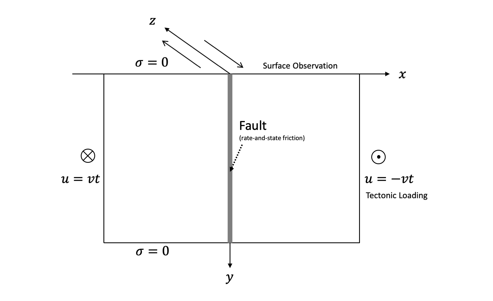
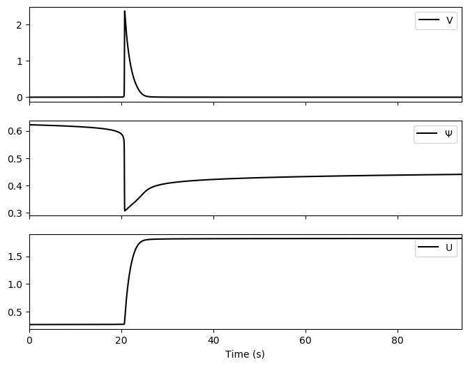

# Earthquake Simulation with Rate-and-State Friction

Here we study a case of earthquake simulation on strike-slip fault.

The fraction on the fault is governed by rate-and-state friction with a aging law:

$$\begin{aligned}
f(V, \Psi) &= a \sinh^{-1} \left(\frac{V}{2V_0} e^{\Phi/a} \right) \\
\dot \Psi &= \frac{bV_0}{D_c} \left( f - f_0 + (b-a) \ln \frac{V}{V_0} \right)
\end{aligned}$$

where $V$ is the fault slip velocity, $\Psi$ is a state variable controlling the fricional process, $D_c$ is the state evolution distance, $a$ and $b$ are dimensionless frictional parameters, $V_0$ is a reference steady sliding velocity, and $f_0$ is the reference friction coefficient for the reference velocity $V_0$. 

!!! note 

    $a < b$: steady state velocity weakening.
    
    $a > b$: steady state velocity strengthening.  

Using quasi-dynamic approximation, the inertial term is approximated by a radiation damping term to account for seismic waves, so force balance on the fault becomes: 

$$\tau = \sigma_{31}(x=0) - \eta V = f(V, \Psi) \sigma_n$$

where $\eta V$ is the radiation damping term, $\sigma_n$ is the effective normal stress. We set $\eta = \frac{\mu}{2 c_s}$, where $\mu$ is the shear modulus and $c_s$ is the shear wave speed.

## Earthquake simulation

## Gradients 