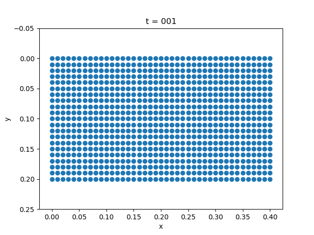

# Elastodynamics

The governing equation for elastodynamics is 
$$
\begin{aligned}
\frac{\partial^2 u}{\partial t^2} &= \mathrm{div}\sigma + f& \Omega\times [0,T]\\
\sigma n &= t & \Gamma_N\times [0,T]\\
u &= u_0 & \Gamma_D\times[0,T]
\end{aligned}
$$
The constitutive law is given by 
$$
\sigma = C\varepsilon
$$
We fix the left side of the plate. We use the alpha method [^alpha].

[^alpha]: Hughes, Thomas JR. *The finite element method: linear static and dynamic finite element analysis*. Courier Corporation, 2012. 


| Gravity                   | External Force        |
| ------------------------- | --------------------- |
|  |  |

```julia
β = 1/4; γ = 1/2
a = b = 0.1
m = 40
n = 20
h = 0.01
NT = 200
Δt = 1/NT 
bdedge = []
for j = 1:n 
  push!(bdedge, [(j-1)*(m+1)+m+1 j*(m+1)+m+1])
end
bdedge = vcat(bdedge...)

bdnode = Int64[]
for j = 1:n+1
  push!(bdnode, (j-1)*(m+1)+1)
end

M = compute_fem_mass_matrix1(m, n, h)
S = spzeros((m+1)*(n+1), (m+1)*(n+1))
M = [M S;S M]

K = compute_fem_stiffness_matrix(D, m, n, h)
C = a*M + b*K # damping matrix 

L = M + γ*Δt*C + β*Δt^2*K
L, Lbd = fem_impose_Dirichlet_boundary_condition(L, bdnode, m, n, h)

a = zeros(2(m+1)*(n+1))
v = zeros(2(m+1)*(n+1))
d = zeros(2(m+1)*(n+1))
U = zeros(2(m+1)*(n+1),NT+1)
for i = 1:NT 
  T = eval_f_on_boundary_edge((x,y)->0.01, bdedge, m, n, h)
  # T = eval_f_on_boundary_edge((x,y)->0.0, bdedge, m, n, h)
  T = [zeros(length(T)) -T]
  T = compute_fem_traction_term(T, bdedge, m, n, h)
  f1 = eval_f_on_gauss_pts((x,y)->0., m, n, h)
  f2 = eval_f_on_gauss_pts((x,y)->0., m, n, h)
  # f2 = eval_f_on_gauss_pts((x,y)->0.1, m, n, h)
  F = compute_fem_source_term(f1, f2, m, n, h)

  rhs = F+T

  td = d + Δt*v + Δt^2/2*(1-2β)*a 
  tv = v + (1-γ)*Δt*a 
  rhs = rhs - C*tv - K*td
  rhs[[bdnode; bdnode.+(m+1)*(n+1)]] .= 0.0

  a = L\rhs 
  d = td + β*Δt^2*a 
  v = tv + γ*Δt*a 
  U[:,i+1] = d
end

x = []
y = []
for j= 1:n+1
  for i = 1:m+1
    push!(x, (i-1)*h)
    push!(y, (j-1)*h)
  end
end
for i = 1:10:NT+1
  close("all")
  scatter(x+U[1:(m+1)*(n+1), i], y+U[(m+1)*(n+1)+1:end, i])
  xlabel("x")
  ylabel("y")
  k = string(i)
  k = repeat("0", 3-length(k))*k 
  title("t = $k")
  ylim(-0.05,0.25)
  gca().invert_yaxis()
  savefig("u$k.png")
end
```

