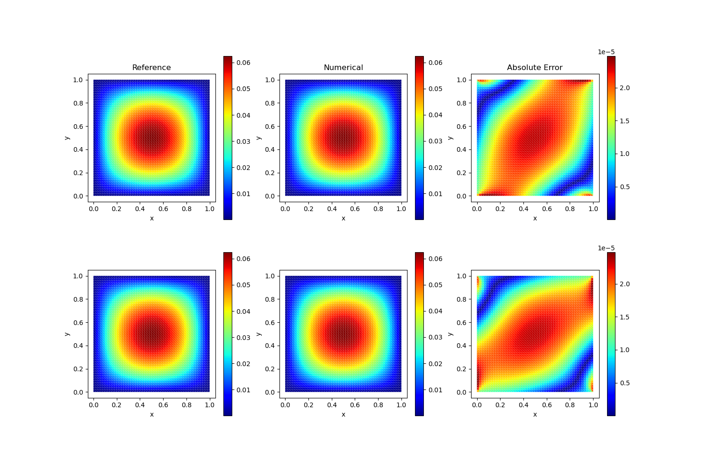
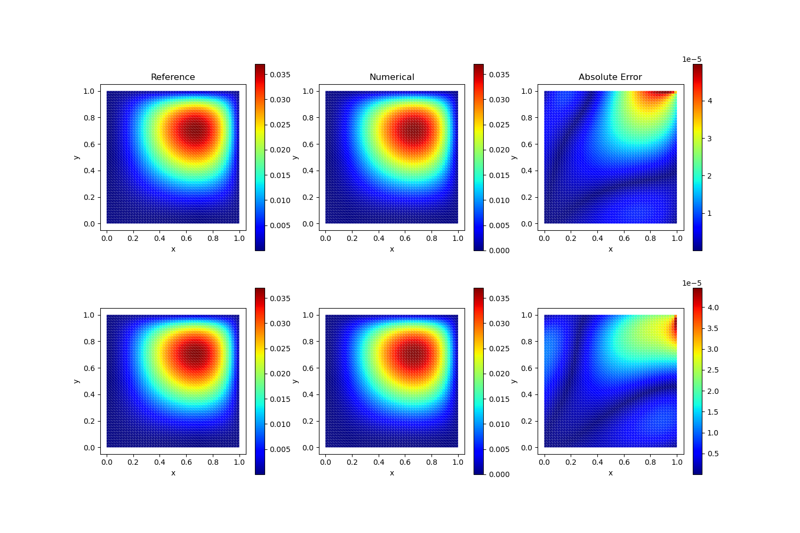
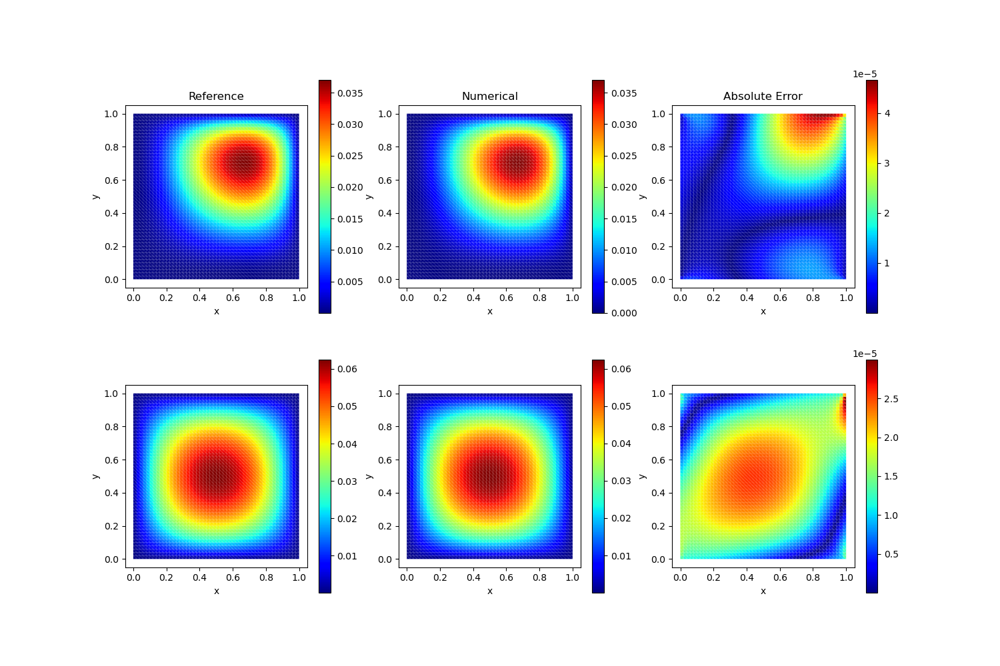

# Mixed Finite Element Methods for Linear Elasticity

The equations of linear elasticity can be written as a system of equations of the form 

$$A\sigma = \varepsilon(u), \quad \text{div} \sigma = f, \text{ in } \Omega\tag{1}$$

Here the unknowns $\sigma$ and $u$ denote the stress and displacement fields, and $f$ is the body force. The stress takes values in the space $\mathbb{S}\in \mathbb{R}^{2\times 2}_{\text{sym}}$ of symmetric matrices. The compliance tensor $A: \mathbb{S}\rightarrow \mathbb{S}$ is a bounded and symmetric, uniformly positive definite operator reflecting the properties of the body. 

This section considers a very simple isotropic case where 

$$A\sigma = \frac{1}{2\mu}\left(\sigma - \frac{\lambda}{2\mu + 3\lambda}\text{tr}\,\sigma I\right)$$

and we use the weak formulation of Eq. 1

Find $(\sigma, v, \rho)\in H(\text{div}, \Omega; M) \times L^2(\Omega; V) \times L^2(\Omega; K)$, such that for all $(\tau, w, \eta)\in H(\text{div}, \Omega; M) \times L^2(\Omega; V) \times L^2(\Omega; K)$

$$\begin{aligned}(A\sigma, \tau) &+ (\text{div}\,\tau, u) &+ (\tau, \rho) &= (\tau\mathbf{n}, u)_{\partial \Omega} \\ (\text{div}\,\sigma, w) &&=(f, w)\\ (\sigma, \eta) && = 0\end{aligned}$$

Here we have used a skew symmetric trial function $\rho$ and test function $\eta$ as a Lagrange multiplier to relax the symmetry condition on $\sigma$.

The code is as follows:

```julia
# Solves the Poisson equation using the Mixed finite element method 
using Revise
using AdFem
using DelimitedFiles
using SparseArrays
using PyPlot


λ = 1.0
μ = 1.0
n = 50
mmesh = Mesh(n, n, 1/n, degree = BDM1)
a = 1/2μ
b = -λ/(2μ*(2μ+2λ))

TestCase = [
    (
        (x,y)->begin;x*y*(x - 1)*(y - 1);end,
        (x,y)->begin;x*y*(x - 1)*(y - 1);end,
        (x,y)->begin;2.0*x^2 + 8.0*x*y - 6.0*x + 6.0*y^2 - 10.0*y + 2.0;end,
        (x,y)->begin;6.0*x^2 + 8.0*x*y - 10.0*x + 2.0*y^2 - 6.0*y + 2.0;end,
    ),
    (
        (x,y)->begin;x^2*y^2*(x - 1)*(y^2 - 1);end,
        (x,y)->begin;x^2*y^2*(x - 1)*(y^2 - 1);end,
        (x,y)->begin;12.0*x^3*y^2 - 2.0*x^3 + 24.0*x^2*y^3 - 12.0*x^2*y^2 - 12.0*x^2*y + 2.0*x^2 + 18.0*x*y^4 - 16.0*x*y^3 - 18.0*x*y^2 + 8.0*x*y - 6.0*y^4 + 6.0*y^2;end,
        (x,y)->begin;36.0*x^3*y^2 - 6.0*x^3 + 24.0*x^2*y^3 - 36.0*x^2*y^2 - 12.0*x^2*y + 6.0*x^2 + 6.0*x*y^4 - 16.0*x*y^3 - 6.0*x*y^2 + 8.0*x*y - 2.0*y^4 + 2.0*y^2;end,
    ),
    (
        (x,y)->begin;x^2*y^2*(x - 1)*(y^2 - 1);end,
        (x,y)->begin;x*y*(x - 1)*(y - 1);end,
        (x,y)->begin;12.0*x^3*y^2 - 2.0*x^3 - 12.0*x^2*y^2 + 2.0*x^2 + 18.0*x*y^4 - 18.0*x*y^2 + 8.0*x*y - 4.0*x - 6.0*y^4 + 6.0*y^2 - 4.0*y + 2.0;end,
        (x,y)->begin;24.0*x^2*y^3 - 12.0*x^2*y + 6.0*x^2 - 16.0*x*y^3 + 8.0*x*y - 6.0*x + 2.0*y^2 - 2.0*y;end,
    )

]

for k = 1:length(TestCase)
    @info "Running TestCase $k..."
    ufunc, vfunc, gfunc, hfunc = TestCase[k]

    A = compute_fem_bdm_mass_matrix(a*ones(get_ngauss(mmesh)), b*ones(get_ngauss(mmesh)), mmesh)
    B = compute_fem_bdm_div_matrix(mmesh)
    C = compute_fem_bdm_skew_matrix(mmesh)

    D = [A B' C'
        B spzeros(2mmesh.nelem, 3mmesh.nelem)
        C spzeros(mmesh.nelem, 3mmesh.nelem)]

    gD = bcedge(mmesh) 
    t1 = eval_f_on_gauss_pts(gfunc, mmesh)
    t2 = eval_f_on_gauss_pts(hfunc, mmesh)
    f1 = compute_fvm_source_term(t1, mmesh)
    f2 = compute_fvm_source_term(t2, mmesh)

    rhs = [zeros(2mmesh.ndof); f1; f2; zeros(mmesh.nelem)]

    sol = D\rhs
    u = sol[2mmesh.ndof+1:2mmesh.ndof+2mmesh.nelem]
    close("all")
    figure(figsize=(15, 10))
    subplot(231)
    title("Reference")
    xy = fvm_nodes(mmesh)
    x, y = xy[:,1], xy[:,2]
    uf = ufunc.(x, y)
    visualize_scalar_on_fvm_points(uf, mmesh)
    subplot(232)
    title("Numerical")
    visualize_scalar_on_fvm_points(u[1:mmesh.nelem], mmesh)
    subplot(233)
    title("Absolute Error")
    visualize_scalar_on_fvm_points( abs.(u[1:mmesh.nelem] - uf) , mmesh)

    subplot(234)
    xy = fvm_nodes(mmesh)
    x, y = xy[:,1], xy[:,2]
    uf = vfunc.(x, y)
    visualize_scalar_on_fvm_points(uf, mmesh)
    subplot(235)
    visualize_scalar_on_fvm_points(u[mmesh.nelem+1:end], mmesh)
    subplot(236)
    visualize_scalar_on_fvm_points( abs.(u[mmesh.nelem+1:end] - uf) , mmesh)
    savefig("varying_elasticity$k.png")
end
```

We have 3 test cases and the results are shown below:

### Test Case 1

Analytical Solution:

$$u(x,y) = xy(x-1)(y-1) \quad v(x,y) = xy(x-1)(y-1)$$



### Test Case 2

Analytical Solution:

$$u(x,y) = x^2y^2(x-1)(y^2-1) \quad v(x,y) = x^2y^2(x-1)(y^2-1)$$





### Test Case 3

Analytical Solution:

$$u(x,y) = x^2y^2(x-1)(y^2-1) \quad v(x,y) = xy(x-1)(y-1)$$
