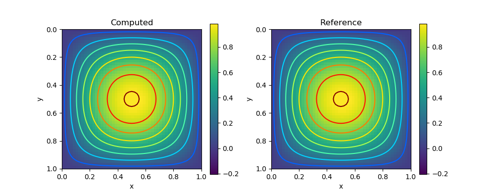
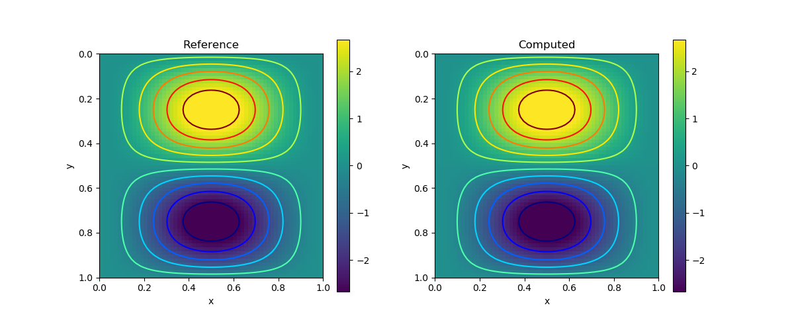
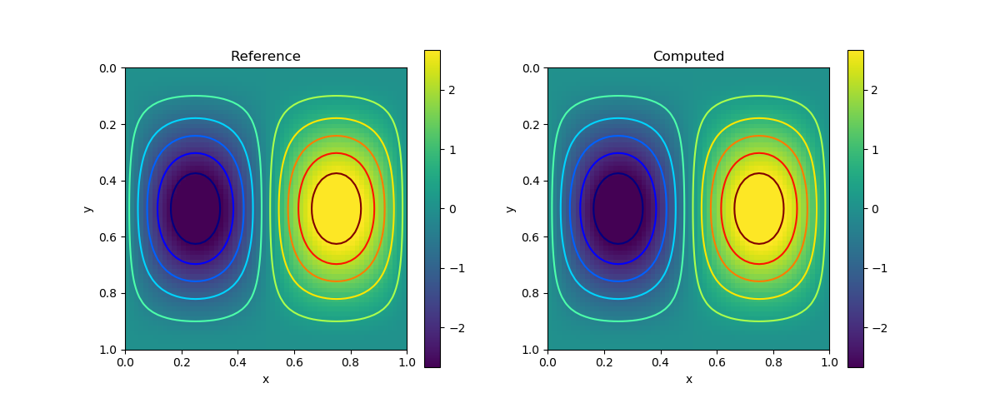
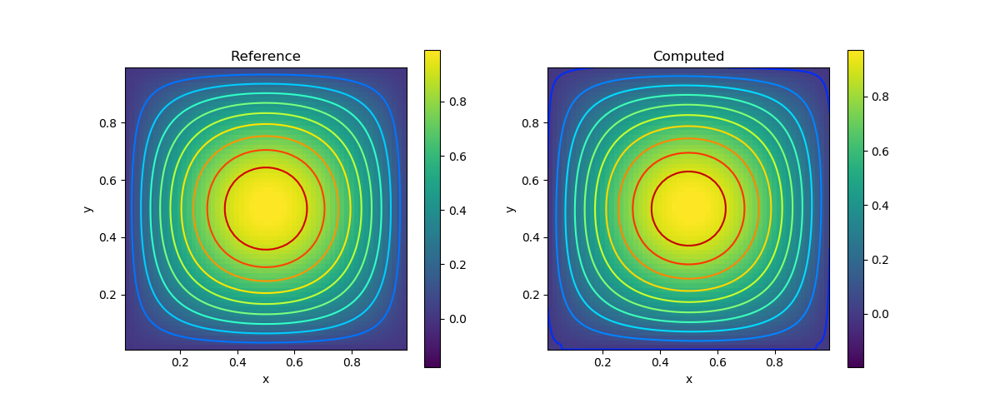

# PDE Galleries

Here is a collection of common partial differential equations and how you can solve them using the PoreFlow library. Unless we specify particularly, the computational domain will be $\Omega = [0,1]^2$. The configuration of the computational domain is as follows


```@raw html

```

We only show the forward modeling, but the inverse modeling is a by-product of the AD-capable implementation!

## Poisson's Equation 

Consider the Poisson's equation 

$$-\Delta u = f \qquad u|_{\partial \Omega} = 0$$

The analytical solution is given by 

$$u(x,y) = \sin \pi x \sin \pi y$$

We have

$$f(x,y) = 2\pi^2 \sin \pi x \sin \pi y$$

```julia
using PyPlot 
using PoreFlow

m = 50; n = 50; h = 1/n 

A = constant(compute_fem_laplace_matrix1(m, n, h))
F = eval_f_on_gauss_pts((x,y)->2π^2*sin(π*x)*sin(π*y), m, n, h)
bd = bcnode("all", m, n, h)
A, _ = fem_impose_Dirichlet_boundary_condition1(A, bd, m, n, h)
rhs = compute_fem_source_term1(F, m, n, h)
rhs[bd] .= 0.0
sol = A\rhs

sess = Session(); init(sess)
S = run(sess, sol)

figure(figsize=(10,4))
subplot(121)
visualize_scalar_on_fem_points(S, m, n, h)
title("Computed")
subplot(122)
visualize_scalar_on_fem_points(eval_f_on_fem_pts((x,y)->sin(π*x)*sin(π*y), m, n, h), m, n, h)
title("Reference")
```



## Stokes's Problem

The Stokes problem is given by 

$$\begin{aligned}
-\nu\Delta \mathbf{u} + \nabla p &= \mathbf{f} & \text{ in } \Omega \\ 
\nabla \cdot \mathbf{u} &= 0 & \text{ in } \Omega \\ 
\mathbf{u} &= \mathbf{0} & \text{ on } \partial \Omega
\end{aligned}$$
Here $\nu$ denotes the fluid viscosity, $f$ is the unit external volumetric force acting on the fluid, $p$ is the pressure, and $\mathbf{u}$ is the fluid velocity. 

The boundary conditions are given by 

$$\begin{aligned}
\mathbf{u} & = \mathbf{0} & \text{ in } \Gamma_1 \\ 
\mathbf{u} \times \mathbf{n} & = \mathbf{0} & \text{ on } \Gamma_2 \\ 
p &= p_0 & \text{ on } \Gamma_2
\end{aligned}$$

Here $\partial \Omega = \bar\Gamma_1\cup \bar \Gamma_2$, $\Gamma_1\cap \Gamma_2 = \emptyset$. 

The second boundary condition indicates that there is no tangential flow. A realistic example is  the cerebral venous network. $\Gamma_1$  corresponds to the lateral boundary (the vessel wall), and $\Gamma_2$ corresponds to the the union of inflow/outflow boundaries. 

!!! info 
    In the weak form, the boundary term from $-\nu\Delta\mathbf{u}$ is 
    $$\int_\Omega u_x v_1 n_1 + u_y v_1 n_2 + v_x v_2 n_1 + v_2 v_2 n_2 d\mathbf{x}$$
    Note that on the no tangential flow boundary gives 
    $$un_2 = n_1 v \Rightarrow u_y n_2  = v_y n_1$$
    Additionally, we have from incompressibility 
    $$u_x + v_y = 0$$

    Combining the above two equations we have
    $$u_x v_1 n_1 + u_y v_1 n_2 = 0$$

    Likewise, $v_x v_2 n_1 + v_2 v_2 n_2 = 0$ on the no tangential boundary. For the other boundary $\Gamma_1$, these two terms vanishes because $v_1 = v_2 = 0$. Therefore, the current boundary condition leads to a zero boundary term. 


We consider the following analytical solution 

$$\begin{aligned}
u(x,y) = 2\pi\sin(\pi x)\sin(\pi x)\cos(\pi y)\sin(\pi y) \\
v(x,y) = -2\pi\sin(\pi x)\sin(\pi y)\cos(\pi x)\sin(\pi y) \\ 
p(x,y) = \sin(\pi x)\sin(\pi y)
\end{aligned}$$

and we let $\nu=0.5$. 

```julia
using PoreFlow
using PyPlot
using SparseArrays

m = 60
n = 60
h = 1/n

function f1func(x,y)
    18.8495559215388*pi^2*sin(pi*x)^2*sin(pi*y)*cos(pi*y) - 6.28318530717959*pi^2*sin(pi*y)*cos(pi*x)^2*cos(pi*y) + pi*sin(pi*y)*cos(pi*x)
end
function f2func(x,y)
    -18.8495559215388*pi^2*sin(pi*x)*sin(pi*y)^2*cos(pi*x) + 6.28318530717959*pi^2*sin(pi*x)*cos(pi*x)*cos(pi*y)^2 + pi*sin(pi*x)*cos(pi*y)
end


ν = 0.5
K = ν*constant(compute_fem_laplace_matrix(m, n, h))
B = constant(compute_interaction_matrix(m, n, h))
Z = [K -B'
-B spdiag(zeros(size(B,1)))]

bd = bcnode("all", m, n, h)
bd = [bd; bd .+ (m+1)*(n+1); ((1:m) .+ 2(m+1)*(n+1))]
Z, _ = fem_impose_Dirichlet_boundary_condition1(Z, bd, m, n, h)


F1 = eval_f_on_gauss_pts(f1func, m, n, h)
F2 = eval_f_on_gauss_pts(f2func, m, n, h)
F = compute_fem_source_term(F1, F2, m, n, h)
xy = fvm_nodes(m, n, h)
rhs = [F;zeros(m*n)]
rhs[bd] .= 0.0
sol = Z\rhs 

sess = Session(); init(sess)
S = run(sess, sol)

xy = fem_nodes(m, n, h)
x, y = xy[:,1], xy[:,2]
U = @. 2*pi*sin(pi*x)*sin(pi*x)*cos(pi*y)*sin(pi*y)
figure(figsize=(12,5))
subplot(121)
visualize_scalar_on_fem_points(U, m, n, h)
title("Reference")
subplot(122)
visualize_scalar_on_fem_points(S[1:(m+1)*(n+1)], m, n, h)
title("Computed")
savefig("stokes1.png")

U = @. -2*pi*sin(pi*x)*sin(pi*y)*cos(pi*x)*sin(pi*y)
figure(figsize=(12,5))
subplot(121)
visualize_scalar_on_fem_points(U, m, n, h)
title("Reference")
subplot(122)
visualize_scalar_on_fem_points(S[(m+1)*(n+1)+1:2(m+1)*(n+1)], m, n, h)
title("Computed")
savefig("stokes2.png")


xy = fvm_nodes(m, n, h)
x, y = xy[:,1], xy[:,2]
p = @. sin(pi*x)*sin(pi*y)
figure(figsize=(12,5))
subplot(121)
visualize_scalar_on_fvm_points(p, m, n, h)
title("Reference")
subplot(122)
visualize_scalar_on_fvm_points(S[2(m+1)*(n+1)+1:end], m, n, h)
title("Computed")
```

| Variable                   | Result                   |
|-----------------------------|---------------------------|
| $u$ |              |
|  $v$                           |  |
|  $p$                           |  |


## Heat Transfer 

We consider the following heat transfer 