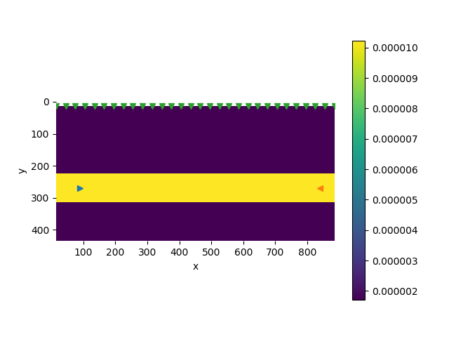

# Coupled Geomechanics and Multiphase Flow

This section is dedicated to the inverse problem of [Coupled Geomechanics and Multiphase Flow](https://kailaix.github.io/PoreFlow.jl/dev/twophaseflow/). We only consider the parameter inverse problem here, i.e., estimating the Lamé constants and the viscosity parameter from surface horizontal displacement data. We have tried solving the function inverse problem---estimating a nonparametric constitutive relation---using the neural network approach in [the single phase flow problem](https://kailaix.github.io/PoreFlow.jl/dev/coupled_viscoelasticity/), but unfortunately it appears that the limited displacement data are insufficient to train a neural network. 

To this end, we generate the observation data---$x$-direction displacement on the surface with the following parameters

Linear Elasticity: $E=6\times 10^9\quad \nu=0.35$

Viscoelasticity: $E=6\times 10^9\quad \nu=0.35\quad \eta = 6.667\times 10^{11}$

To test the robustness of the algorithm, we add different levels of noise to the observation data $u_{\mathrm{obs}}$:

$$(\tilde u_{\mathrm{obs}})_i = (u_{\mathrm{obs}})_i(1+\sigma w_i)$$

where $\sigma = 0, 0.01, 0.05$ and $0.1$, and $w_i$ is a standard normal variable. 

**Linear Elasticity**

We measure the error by $\frac{\|H-H^*\|_2}{\|H^*\|_2}$, where $H$ is the exact elastic tangent matrix. The exact matrix is 

$$H^* = \begin{bmatrix}9.62963 & 5.18519 & 0.0    \\
 5.18519 & 9.62963 & 0.0    \\
 0.0    &  0.0    &  2.22222\end{bmatrix}$$

The initial guess for the matrix is

$$H_0 = 10^9 \times \begin{bmatrix}1 & 0 & 0\\0 & 1 & 0 \\ 0 & 0 & 1\end{bmatrix}$$

We also ensure that the matrix is symmetric positive semidefinite by optimizating $H = DD'$, where $D$ is a free variable of size $3\times 3$.  

| Noise Level               | $\sigma=0$                                                   | $\sigma=0.01$                                                | $\sigma=0.05$                                                | $\sigma=0.1 $                                                |
| ------------------------- | ------------------------------------------------------------ | ------------------------------------------------------------ | ------------------------------------------------------------ | ------------------------------------------------------------ |
| Estimated ($\times 10^9$) | $\left[\begin{array}{ccc}9.6302 & 5.1853 & -0.0001 \\5.1853 & 9.6318 & 0.0001 \\-0.0001 & 0.0001 & 2.2234 \\\end{array}\right]$ | $\left[\begin{array}{ccc}9.6925 & 5.2306 & -0.0201 \\5.2306 & 9.7894 & -0.0037 \\-0.0201 & -0.0037 & 2.3537 \\\end{array}\right]$ | $\left[\begin{array}{ccc}10.409 & 5.0079 & -0.3379 \\5.0079 & 11.1585 & -0.1039 \\-0.3379 & -0.1039 & 3.5966 \\\end{array}\right]$ | $\left[\begin{array}{ccc}10.3964 & 5.0069 & -0.3472 \\5.0069 & 11.9231 & 0.009 \\-0.3472 & 0.009 & 3.9155 \\\end{array}\right]$ |
| Error                     | $1.6200\times 10^{-4}$                                       | $1.4554\times 10^{-2}$                                       | $1.4518\times 10^{-1}$                                       | $1.9220\times 10^{-1}$                                       |
| Iterations                | 72                                                           | 88                                                           | 81                                                           | 72                                                           |

**Viscoelasticity**

We report the relative error for each parameter $\mu$, $\lambda$, and $\eta^{-1}$ (for convenience, we use the reciprocal of $\eta$ for numerical simulations). The initial guesses are $10^9$, $10^9$ and $10^{-12}$ respectively. The exact values are 

$$\mu^* = 2.22 \times 10^9\quad \lambda^* =  5.19\times 10^9\quad (\eta^*)^{-1} = 1.5\times 10^{-12}$$

| Noise Level                     | $\sigma=0$           | $\sigma=0.01$        | $\sigma=0.05$        | $\sigma=0.1$         |
| ------------------------------- | -------------------- | -------------------- | -------------------- | -------------------- |
| $\mu$ ($\times 10^9 $)          | 2.2222               | 2.2339               | 2.1949               | 2.1711               |
| Error                           | $2.01\times 10^{-6}$ | $5.25\times 10^{-3}$ | 1.23e-02             | $2.30\times 10^{-2}$ |
| $\lambda$ ($\times 10^9$)       | 5.1852               | 5.1729               | 5.222                | 5.2602               |
| Error                           | $1.32\times 10^{-7}$ | $2.38\times 10^{-3}$ | $7.10\times 10^{-3}$ | $1.45\times 10^{-2}$ |
| $\eta^{-1}$ ($\times 10^{-12}$) | 1.5                  | 1.4936               | 1.5154               | 1.5242               |
| Error                           | $8.02\times 10^{-7}$ | $4.28\times 10^{-3}$ | $1.02\times 10^{-2}$ | $1.61\times 10^{-2}$ |
| Iterations                      | 29                   | 29                   | 29                   | 30                   |

We can see our inversion method is quite accurate and robust. 