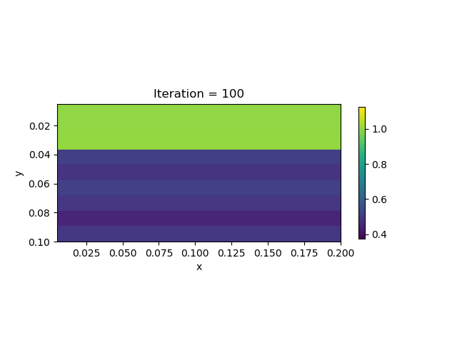
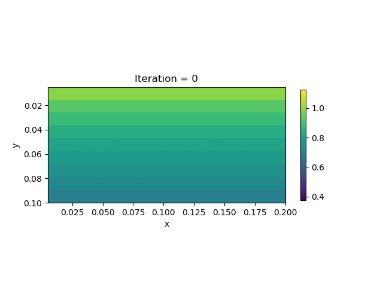

#  Viscoelasticity Inversion

## Viscoelastic model based with Maxwell material:

- Momentum balance:

$$\sigma_{ij,j} + \rho f_i = \rho \ddot u_i$$

- Constitutive law:

$$\dot \sigma_{ij} + \frac{\mu}{\eta} \left( \sigma_{ij} - \frac{\sigma_{kk}}{3}\delta_{ij} \right) = 2\mu \dot \varepsilon_{ij} + \lambda \dot\varepsilon_{kk}\delta_{ij}$$

- Boundary conditions:

$$\bm{\sigma} \mathbf{n} = \mathbf{t}$$

&&\begin{aligned}
\mathbf{t} &= 0 & \mbox{Top or Bottom} \\ 
\mathbf{t} &= [-T, 0] & \mbox{Right}
\end{aligned}&&

$$u=0 \ \mbox{Left}$$

- The model consists of two layers of differnt vicosity. 

## Forward simulation:

## Inversion based on horizontal displacement ($x$) on the surface.

| True model                                     | Inverted result                                   | 
| -----------------------------------------------| --------------------------------------------------| 
|    |     |

- Iterations during inversion
