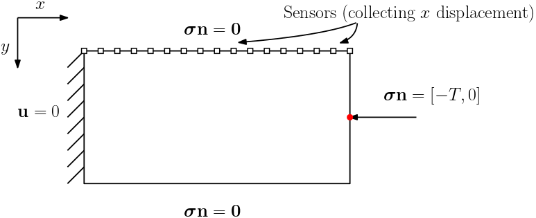
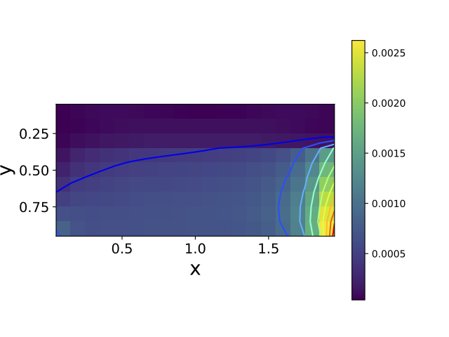
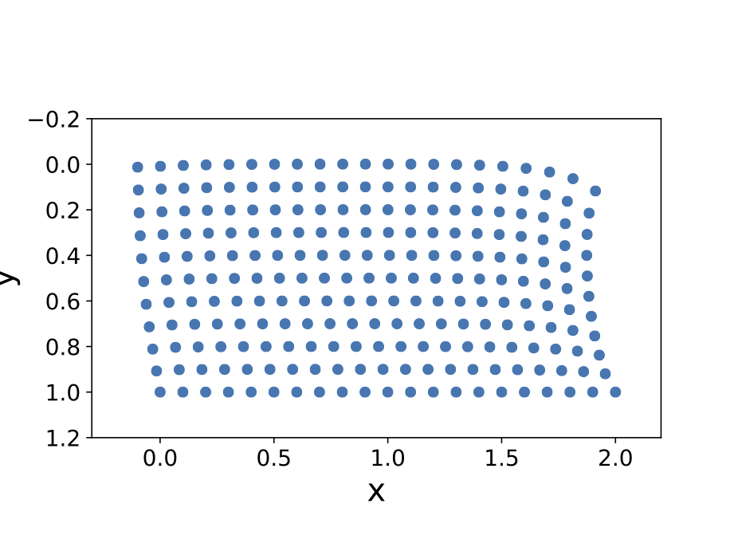
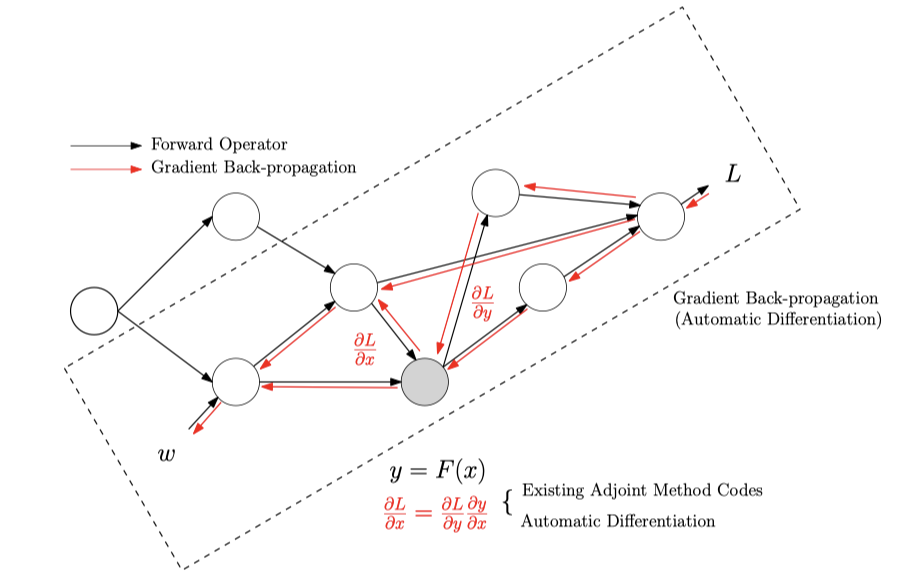
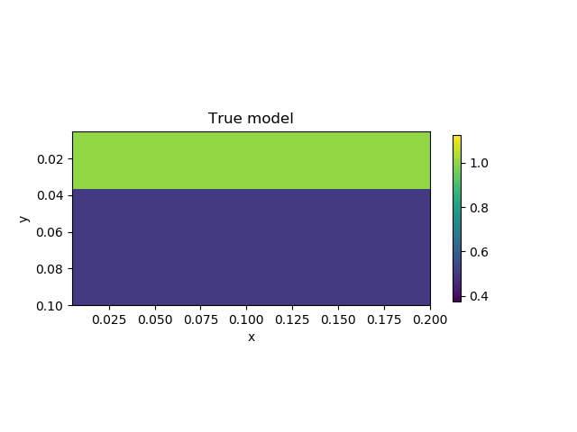
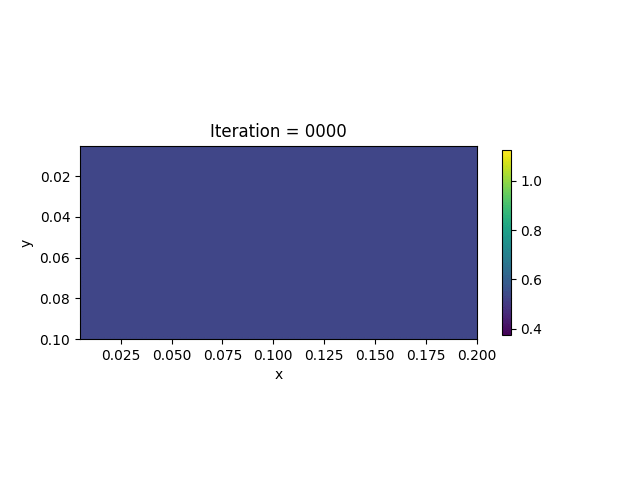

#  Inverse Modeling for Space Varying Viscoelasticity 


## Problem Description

In this example, we consider the Maxwell viscoelasticity model. The governing equations are


- Momentum Balance:

$$\sigma_{ij,j} + \rho f_i = \rho \ddot u_i$$

- Constitutive Relation (Plane Strain Viscoelasticity):

$$\dot \sigma_{ij} + \frac{\mu}{\eta} \left( \sigma_{ij} - \frac{\sigma_{kk}}{3}\delta_{ij} \right) = 2\mu \dot \varepsilon_{ij} + \lambda \dot\varepsilon_{kk}\delta_{ij}$$

- Boundary Conditions:

$$\begin{aligned}
\bm{\sigma} \mathbf{n} &=
\begin{cases}
0 & \text{Top or Bottom} \\ 
[-T, 0] & \text{Right} \\
\end{cases}  \\
\mathbf{u} &=0 \text{\hspace{3.1cm} Left} &
\end{aligned}$$





We assume that the Lamé constants $\lambda$ and $\mu$ are given. The viscosity $\eta$ is spatial varying. We want to **estimate $\eta$ based on the measurement of surface horizontal displacements**. The true model consists of two layers of different vicosity. 


| True Viscosity Distribution  | Von Mises Stress at Terminal Time   | Displacement at Terminal Time     |
| ---------------------------- | ----------------------------------- | --------------------------------- |
|  |  |  |


## Forward simulation

We implement the forward simulation using finite element analysis discretization and $\alpha$-scheme, an implicit time stepping scheme that offers good stability and accuracy. 


## Inversion Method

We formulate the loss function as the discrepancy between observations and predictions

$$\mathcal{J}(\eta) = \sum_{i=1}^{N_T} \sum_{k=1}^{m+1} (\mathbf{u}_{ik}^{\mathrm{obs}}- \mathbf{u}_i(x_k, 0))^2$$

Unlike the linear elasticity case, in the viscoelasticity case, the stress is history-dependent. Therefore, when we calculate the gradients $\frac{\partial\mathcal{J}}{\partial \eta}$, the state variables are both $\mathbf{u}$ and $\bm{\sigma}$. Additionally, in each time step, since we have used an implicit scheme, we need to solve an equation 

$$A(\eta, \bm{\sigma}^{n+1}) \mathbf{u}^{n+1} = \mathbf{f}(\bm{\sigma}^n, \mathbf{u}^{n})$$ 

The state adjoint method requires us to compute the gradients of 

$$\mathbf{u}^{n+1}(\bm{\sigma}^n, \eta, \mathbf{u}^{n}) = A(\eta, \bm{\sigma}^{n+1})^{-1} \mathbf{f}(\bm{\sigma}^n, \mathbf{u}^{n})\tag{1}$$

with respect to $\bm{\sigma}^n$, $\eta$ and $\mathbf{u}^{n}$. 


Surprisingly, the seemingly complex formula (1) admits a simple implementation using automatic differentiation (of course a special technique called **physics constrained learning** is needed). Once the gradients $\frac{\partial\mathcal{J}}{\partial \eta}$ is computed, the inversion problem can be solved using gradient-based optimization techniques (e.g., LBFGS).




## Numerical Example

We present the numerical example here. The true model and inverted model are shown as follows. We assume that the viscosity values are the same horizontally. 

| True model                                   | Inverted result                  |
| -------------------------------------------- | -------------------------------- |
|  |  |


We also show the inversion results in each iteration:




## Codes

The highlights of the implementation are


- The $\alpha$-scheme for time stepping. A stable scheme is important for inversion since we need to try out different parameters, which may crash the simulation if the scheme is sensitive to physical parameters. Therefore, we chose the $\alpha$ scheme, which is an implicit scheme that offers satisfactory stability. 

- `while_loop`. `while_loop` mechanism allows us to create only one computational graph for all the iterations. This is essential for simulations that span large time horizons. Fortunately, TensorFlow offers this functionality. 

- Custom sparse solver. We have used [custom sparse solvers](https://kailaix.github.io/ADCME.jl/dev/api/#Base.:\) in `ADCME`, which uses Eigen `SparseLU` as the backend. The sparse solver is the key for efficient implementation of physics constrained learning; otherwise, direct implementation in TensorFlow will convert the sparse matrix to dense and then invoke BLAS libraries. 

```julia
using Revise
using PoreFlow
using PyCall
using LinearAlgebra
using PyPlot
using SparseArrays
using MAT
np = pyimport("numpy")


mode = "training"

## alpha-scheme
β = 1/4; γ = 1/2
a = b = 0.1

n = 10
m = 2n 
h = 0.01
NT = 500
it0 = 1
Δt = 2.0/NT
ηmax = 1
ηmin = 0.5

bdedge = bcedge("right", m, n, h)
bdnode = bcnode("lower", m, n, h)

# λ = Variable(1.0)
# μ = Variable(1.0)
# invη = Variable(1.0)

function eta_model(idx)
  if idx == 1
    out = ηmin * ones(n)
    out[1:div(n,3)] .= ηmax
    out
  elseif idx==2
    out = ηmin * ones(4, m, n)
    out[:, :, 1:div(n,3)] .= ηmax
    out[:, :, 2div(n,3):end] .= ηmax
    out[:]
  end
end

function visualize_inv_eta(X, k)
    x = LinRange(0.5h,m*h, m)
    y = LinRange(0.5h,n*h, n)
    V = zeros(m, n)
    for i = 1:m  
        for j = 1:n 
            elem = (j-1)*m + i 
            V[i, j] = mean(X[4(elem-1)+1:4elem])
        end
    end
    close("all")
    pcolormesh(x, y, V'/50.0, vmin=ηmin-(ηmax-ηmin)/4, vmax=ηmax+(ηmax-ηmin)/4)
    colorbar(shrink=0.5)
    xlabel("x")
    ylabel("y")
    # title("Iteration = $k")
    axis("scaled")
    gca().invert_yaxis()
    if k == "true"
      title("True Model")
      savefig("true.png")
      return 
    end
    k_ = string(k)
    k_ = reduce(*, "0" for i = 1:4-length(k_))*k_
    title("Iteration = $k_")
    savefig("iter$k_.png")
end

λ = constant(2.0)
μ = constant(0.2)
if mode=="data"
  global invη_var = constant(eta_model(1))
  invη = reshape(repeat(invη_var, 1, 4m), (-1,))
  global invη *= 50.0
else
    global invη_var = Variable((ηmin + ηmax)/2*ones(n))
    invη_ = reshape(repeat(invη_var, 1, 4m), (-1,))
    # invη_ = constant(eta_model(1))
    global invη = 50.0*invη_
end


fn_G = invη->begin 
  G = tensor([1/Δt+μ*invη -μ/3*invη 0.0
    -μ/3*invη 1/Δt+μ*invη-μ/3*invη 0.0
    0.0 0.0 1/Δt+μ*invη])
  invG = inv(G)
end
invG = map(fn_G, invη)
S = tensor([2μ/Δt+λ/Δt λ/Δt 0.0
    λ/Δt 2μ/Δt+λ/Δt 0.0
    0.0 0.0 μ/Δt])
H = invG*S


M = compute_fem_mass_matrix1(m, n, h)
Zero = spzeros((m+1)*(n+1), (m+1)*(n+1))
M = SparseTensor([M Zero;Zero M])

K = compute_fem_stiffness_matrix(H, m, n, h)
C = a*M + b*K # damping matrix 
L = M + γ*Δt*C + β*Δt^2*K
L, Lbd = fem_impose_Dirichlet_boundary_condition_experimental(L, bdnode, m, n, h)


a = TensorArray(NT+1); a = write(a, 1, zeros(2(m+1)*(n+1))|>constant)
v = TensorArray(NT+1); v = write(v, 1, zeros(2(m+1)*(n+1))|>constant)
d = TensorArray(NT+1); d = write(d, 1, zeros(2(m+1)*(n+1))|>constant)
U = TensorArray(NT+1); U = write(U, 1, zeros(2(m+1)*(n+1))|>constant)
Sigma = TensorArray(NT+1); Sigma = write(Sigma, 1, zeros(4*m*n, 3)|>constant)
Varepsilon = TensorArray(NT+1); Varepsilon = write(Varepsilon, 1,zeros(4*m*n, 3)|>constant)


Forces = zeros(NT, 2(m+1)*(n+1))
for i = 1:NT
  T = eval_f_on_boundary_edge((x,y)->0.1, bdedge, m, n, h)

  # if i>=NT÷2
  #   T *= 0.0
  # end
  T = [-T T]
#   T = [T T]
  rhs = compute_fem_traction_term(T, bdedge, m, n, h)

#   if i*Δt>0.5
#     rhs = zero(rhs)
#   end
  Forces[i, :] = rhs
end
Forces = constant(Forces)

function condition(i, tas...)
  i <= NT
end

function body(i, tas...)
  a_, v_, d_, U_, Sigma_, Varepsilon_ = tas
  a = read(a_, i)
  v = read(v_, i)
  d = read(d_, i)
  U = read(U_, i)
  Sigma = read(Sigma_, i)
  Varepsilon = read(Varepsilon_, i)

  res = batch_matmul(invG/Δt, Sigma)
  F = compute_strain_energy_term(res, m, n, h) - K * U
  rhs = Forces[i] - Δt^2 * F

  td = d + Δt*v + Δt^2/2*(1-2β)*a 
  tv = v + (1-γ)*Δt*a 
  rhs = rhs - C*tv - K*td
  rhs = scatter_update(rhs, constant([bdnode; bdnode.+(m+1)*(n+1)]), constant(zeros(2*length(bdnode))))


  ## alpha-scheme
  a = L\rhs # bottleneck  
  d = td + β*Δt^2*a 
  v = tv + γ*Δt*a 
  U_new = d

  Varepsilon_new = eval_strain_on_gauss_pts(U_new, m, n, h)

  res2 = batch_matmul(invG * S, Varepsilon_new-Varepsilon)
  Sigma_new = res +  res2

  i+1, write(a_, i+1, a), write(v_, i+1, v), write(d_, i+1, d), write(U_, i+1, U_new),
        write(Sigma_, i+1, Sigma_new), write(Varepsilon_, i+1, Varepsilon_new)
end


i = constant(1, dtype=Int32)
_, _, _, _, u, sigma, varepsilon = while_loop(condition, body, 
                  [i, a, v, d, U, Sigma, Varepsilon])

U = stack(u)
Sigma = stack(sigma)
Varepsilon = stack(varepsilon)

if mode!="data"
  data = matread("viscoelasticity.mat")
  global Uval,Sigmaval, Varepsilonval = data["U"], data["Sigma"], data["Varepsilon"]
  U.set_shape((NT+1, size(U, 2)))
  idx0 = 1:4m*n
  Sigma = map(x->x[idx0,:], Sigma)

  idx = collect(1:m+1)
  global loss = sum((U[it0:end, idx] - Uval[it0:end, idx])^2) 
end

sess = Session(); init(sess)

cb = (v, i, l)->begin
  println("[$i] loss = $l")
  if mod(i,20)==0
    inv_eta = v[1]
    visualize_inv_eta(inv_eta, i)
    matwrite("eta$i.mat", Dict("eta"=>inv_eta))
  end
end

if mode=="data"
  Uval,Sigmaval, Varepsilonval = run(sess, [U, Sigma, Varepsilon])
  matwrite("viscoelasticity.mat", Dict("U"=>Uval, "Sigma"=>Sigmaval, "Varepsilon"=>Varepsilonval))

  visualize_von_mises_stress(Sigmaval, m, n, h, name="_viscoelasticity")
  visualize_scattered_displacement(Array(Uval'), m, n, h, name="_viscoelasticity", 
                  xlim_=[-2h, m*h+2h], ylim_=[-2h, n*h+2h])

  close("all")
  plot(LinRange(0, 20, NT+1), Uval[:,m+1])
  xlabel("Time")
  ylabel("Displacement")
  savefig("disp.png")

  cb([run(sess, invη)], "true", 0.0)
  error("Stop!")
end

v_ = []
i_ = []
l_ = []

loss_ = BFGS!(sess, loss*1e10, vars=[invη], callback=cb, var_to_bounds=Dict(invη_var=>(0.1,2.0)))

```