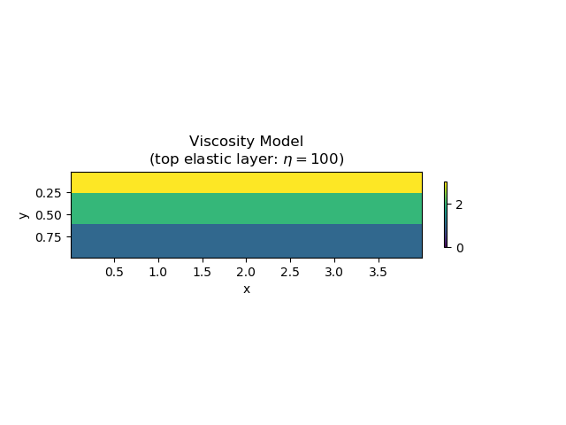
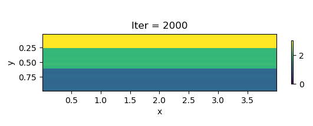
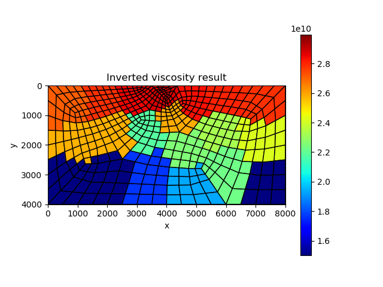

# Inversion of viscoelasticity of the Earth

In [previous section](https://kailaix.github.io/PoreFlow.jl/dev/viscoelasticity_earth/)


## Viscosity Inversion under Strike-slip Fault Setting

| True model                   | Inverted result                  |
| ---------------------------- | -------------------------------- |
|  |  |


We also show the inversion results in each iteration:

```@raw html
<center>

</center>
```

## Viscosity Inversion under Dip-slip Fault Setting

| True model                   | Inverted result                  |
| ---------------------------- | -------------------------------- |
|  |  |


We also show the inversion results in each iteration:

```@raw html
<center>

</center>
```