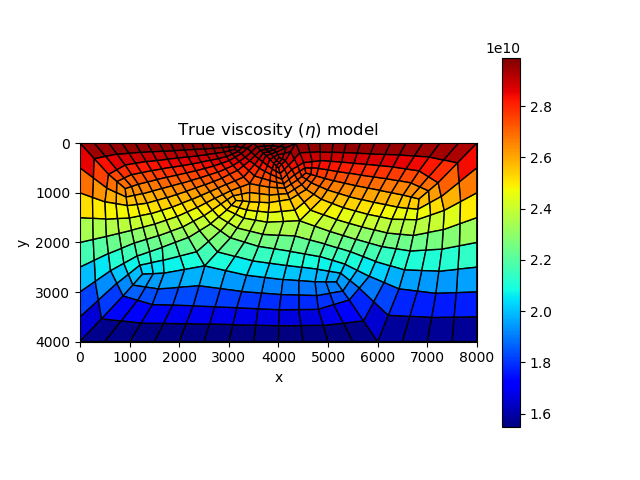

# Viscoelasticity Model for the Earth 

In [previous section](https://kailaix.github.io/PoreFlow.jl/dev/viscoelasticity_earth/), we show how to conduct forward computation of viscoelasticity models for the earth. In this section, we use a gradient-based optimization approach for calibrating the spatial-varying viscoelasticity parameters for the viscoelasticity model. The major function we use is [`ViscoelasticitySolver`](@ref) in [NNFEM](https://github.com/kailaix/NNFEM.jl/) in the NNFEM package.  


In the following examples, we calibrate the viscoelasticity parameters $\eta$ from displacement data on the surface. 

## Strike-slip Fault

| True model                   | Inverted result                  |
| ---------------------------- | -------------------------------- |
|  |  |


We also show the inversion results in each iteration:

```@raw html
<center>

</center>
```


Code: 

## Dip-slip Fault 

| True model                   | Inverted result                  |
| ---------------------------- | -------------------------------- |
|  |  |


We also show the inversion results in each iteration:

```@raw html
<center>

</center>
```

Code: [dippingfault_viscosity_forward.jl](https://github.com/kailaix/PoreFlow.jl/blob/master/research/earthquake/dipslip/dippingfault_viscosity_forward.jl), [dippingfault_viscosity_inversion.jl](https://github.com/kailaix/PoreFlow.jl/blob/master/research/earthquake/dipslip/dippingfault_viscosity_inversion.jl), [load_domain_function.jl](https://github.com/kailaix/PoreFlow.jl/blob/master/research/earthquake/dipslip/load_domain_function.jl).