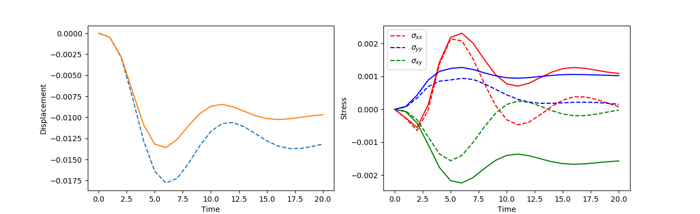
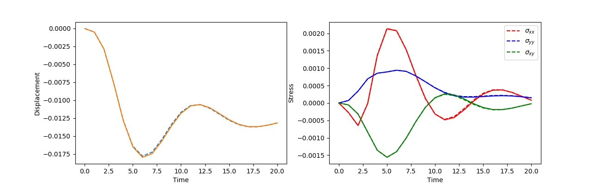
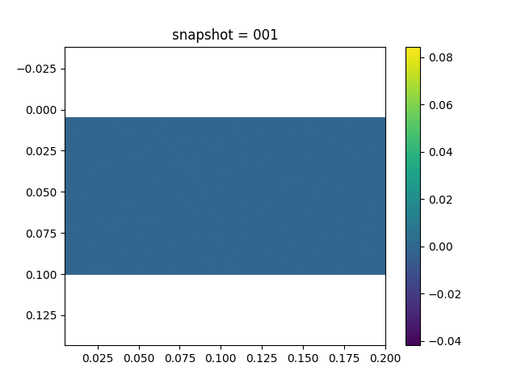

#  Inverse Modeling for Nonparametric Viscoelasticity 

In this section, we consider learning a nonparametric viscoelasticity model. We assume the Maxwell model for the material. However, the viscosity parameter is assumed to be a function of the stress

$$\eta(\sigma) = 10 + \frac{5}{1+1000 (\sigma_{xx}^2 + \sigma_{yy}^2 + \sigma_{xy}^2)} \tag{2}$$

This relation makes the constitutive equation (1) in [this section](https://kailaix.github.io/PoreFlow.jl/dev/viscoelasticity/#Numerical-Example-1) nonlinear. 

For the numerical simulation, we fix the bottom side of the computational domain and impose external pressure on the right hand side. Traction-free conditions are assumed for all other sides. 

To model the constitutive relation (2), we approximate $\eta$ by a neural network. The neural network takes the 3-dimensional stress as input and outputs a 1-dimensional viscosity parameter. The $\alpha$-scheme is used for the numerical simulation for stability. Using a robust and stable numerical scheme is very important in these NN-FEM hybrid models because the neural network might yield an ill-conditioned relation and causes numerical instabilities.

The observation data are the $x$-direction displacement on the surface.  

We have tried different neural network architectures with different activation functions, widths, and depths and found that different architectures all perform reasonably well. Here we present the result for a fully-connected neural network with 3 hidden layers, 20 neurons per layer, and with the tanh activation function.   The following plots show both the $x$-direction displacement and the stresses of the left top point. The dashed line show the exact displacement

| Initial                      | Learned                      |
| ---------------------------- | ---------------------------- |
|  |  |

We also show the movies of displacement and stress changes using the learned constitutive relations

| Displacement                                                 | Stress                                 |
| ------------------------------------------------------------ | -------------------------------------- |
|  |  |

