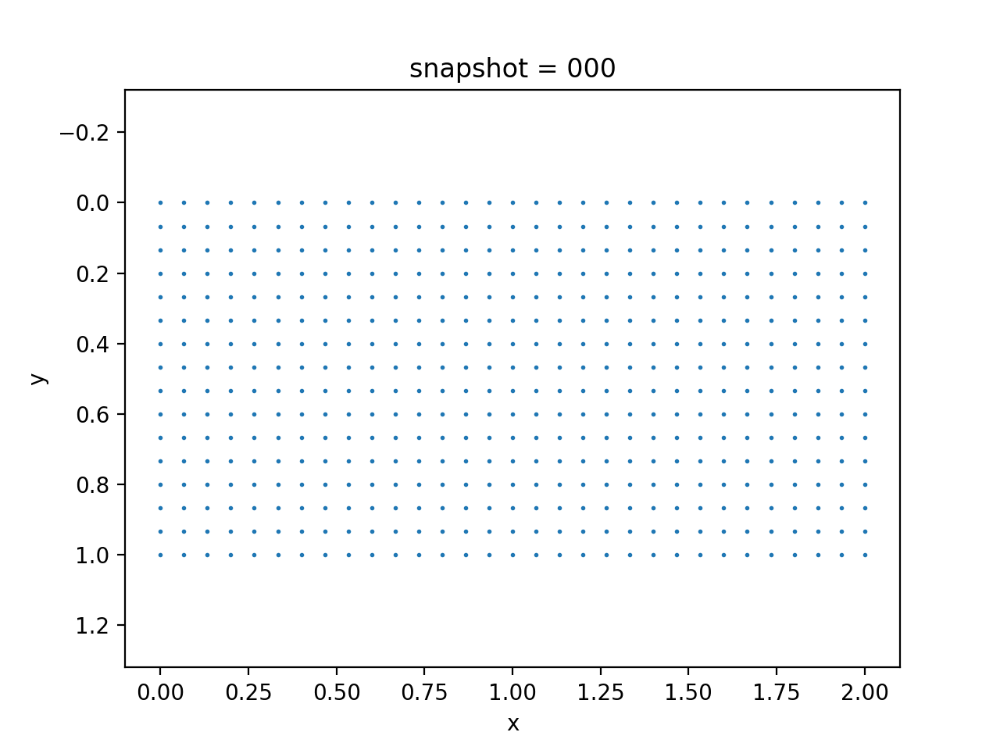
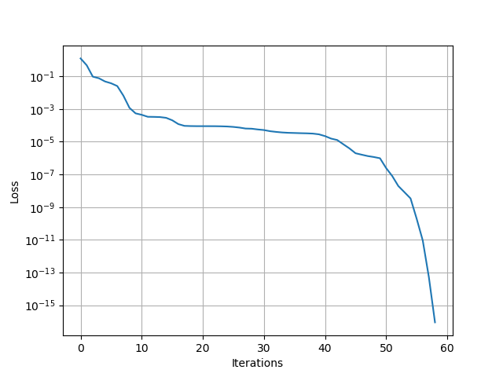

# Inverse Modeling for Poroelasticity Models

We have coupled geomechanics and single phase flow in [`Coupled Geomechanics and Single Phase Flow`](https://kailaix.github.io/PoreFlow.jl/dev/coupled/) (poroelasticity). The governing equation for poroelasticity model is 

$$\begin{aligned}
\mathrm{div}\sigma(u) - b \nabla p &= 0\\
\frac{1}{M} \frac{\partial p}{\partial t} + b\frac{\partial \varepsilon_v(u)}{\partial t} - \nabla\cdot\left(\frac{k}{B_f\mu}\nabla p\right) &= f(x,t)\\
\sigma(u) = H\varepsilon(u)
\end{aligned}$$

We impose no-flow boundary condition on left, right, and bottom sides for $p$, i.e., $\nabla p \cdot n=0$, and a zero pressure boundary condition on the top side, i.e., $p=0$. Additionally, we assume a fixed Dirichlet boundary condition for $u$ on the left and right side, and traction free boundary conditions for $u$ on all other three sides, i.e., $\sigma(u)n = 0$. We show the data in the following. 

| Displacement                | Pressure                    | Von Mises Stress            |
| --------------------------- | --------------------------- | --------------------------- |
|  |  |  |

We estimate the elasticity tensor $H$ by solving a minimization problem 

$$\min_H \sum_{i\in\mathcal{I}} (u^{\mathrm{obs}}_i-u_i)^2$$

where $\mathcal{I}$ is the index set for horizontal displacement  on the top side, $u^{\mathrm{obs}}_i$ is the corresponding observation. 



| Initial Guess                                                | Estimated $H$                                                | Reference $H$                                                |
| ------------------------------------------------------------ | ------------------------------------------------------------ | ------------------------------------------------------------ |
| $$\begin{bmatrix}1 &   0 & 0 \\ 0 & 1  & 0 \\ 0    &  0    &  1\\\end{bmatrix}$$ | $$\begin{bmatrix}1.604938 & 0.864197 & -0.0 \\0.864197 & 1.604938 & -0.0 \\-0.0 & -0.0 & 0.370371 \\\end{bmatrix}$$ | $$\begin{bmatrix}1.604938 & 0.864198 & 0.0 \\0.864198 & 1.604938 & 0.0 \\0.0 & 0.0 & 0.37037 \\\end{bmatrix}$$ |

To test the robustness of the method, we add noise to our observations

$$(u_{\mathrm{obs}})_i = u_i (1+\sigma \varepsilon_i)$$

where $\varepsilon_i$ are i.i.d. Gaussian noise with unit standard deviations and zero means. 

```julia
using Revise
using PoreFlow
using PyCall
using LinearAlgebra
using ADCME
using MAT
using PyPlot
using ADCMEKit

np = pyimport("numpy")

# Domain information 
NT = 50
Δt = 1/NT
n = 15
m = 2*n 
h = 1. ./ n
bdnode = bcnode("left | right", m, n, h)
bdedge = bcedge("upper", m, n, h) # fixed pressure on the top 

b = 1.0
E = 1.0
ν = 0.35
Href = E/(1+ν)/(1-2ν) * [1-ν ν 0.0;ν 1-ν 0.0;0.0 0.0 (1-2ν)/2]

H = spd(Variable(diagm(0=>ones(3))))

Q, Prhs = compute_fvm_tpfa_matrix(ones(4*m*n), bdedge, zeros(size(bdedge,1)),m, n, h)
Q = SparseTensor(Q)
K = compute_fem_stiffness_matrix(H, m, n, h)
L = SparseTensor(compute_interaction_matrix(m, n, h))
M = SparseTensor(compute_fvm_mass_matrix(m, n, h))
A = [K -b*L'
b*L/Δt 1/Δt*M-Q]
A, Abd = fem_impose_coupled_Dirichlet_boundary_condition(A, bdnode, m, n, h)
U = zeros(m*n+2(m+1)*(n+1), NT+1)
x = Float64[]; y = Float64[]
for j = 1:n+1
    for i = 1:m+1
        push!(x, (i-1)*h)
        push!(y, (j-1)*h)
    end
end
    
# injection and production
injection = (div(n,2)-1)*m + 3
production = (div(n,2)-1)*m + m-3


function get_disp(SOURCE_SCALE)
    
    function condition(i, tas...)
        i<=NT
    end

    function body(i, tas...)
        ta_u, ta_ε, ta_σ = tas
        u = read(ta_u, i)
        σ0 = read(ta_σ, i)
        ε0 = read(ta_ε, i)

        g = -ε0*H
        rhs1 = compute_strain_energy_term(g, m, n, h)

        rhs1 = scatter_update(rhs1, [bdnode; bdnode .+ (m+1)*(n+1)], zeros(2length(bdnode)))
        rhs2 = zeros(m*n)
        rhs2[injection] += SOURCE_SCALE * h^2
        rhs2[production] -= SOURCE_SCALE * h^2
        rhs2 = rhs2 + b*L*u[1:2(m+1)*(n+1)]/Δt + 
                M * u[2(m+1)*(n+1)+1:end]/Δt + Prhs
        
        rhs = [rhs1;rhs2]
        o = A\rhs 

        ε = eval_strain_on_gauss_pts(o, m, n, h)
        σ = ε*H

        ta_u = write(ta_u, i+1, o)
        ta_ε = write(ta_ε, i+1, ε)
        ta_σ = write(ta_σ, i+1, σ)
        i+1, ta_u, ta_ε, ta_σ
    end

    i = constant(1, dtype=Int32)
    ta_u = TensorArray(NT+1); ta_u = write(ta_u, 1, constant(zeros(2(m+1)*(n+1)+m*n)))
    ta_ε = TensorArray(NT+1); ta_ε = write(ta_ε, 1, constant(zeros(4*m*n, 3)))
    ta_σ = TensorArray(NT+1); ta_σ = write(ta_σ, 1, constant(zeros(4*m*n, 3)))
    _, u_out, ε_out, σ_out = while_loop(condition, body, [i, ta_u, ta_ε, ta_σ])
    u_out = stack(u_out)
    u_out.set_shape((NT+1, size(u_out,2)))
    σ_out = stack(σ_out)
    ε_out = stack(ε_out)

    upper_idx = Int64[]
    for i = 1:m+1
        push!(upper_idx, (div(n,3)-1)*(m+1)+i)
        push!(upper_idx, (div(n,3)-1)*(m+1)+i + (m+1)*(n+1))
    end
    for i = 1:m 
        push!(upper_idx, (div(n,3)-1)*m+i+2(m+1)*(n+1))
    end

    u_out, σ_out
end

U, S = get_disp(500.0)

uobs = matread("data.mat")["U"][:, 1:m+1]
upred = set_shape(U,(NT+1,2(m+1)*(n+1)+m*n))[:, 1:m+1]
loss = sum((uobs-upred)^2)
err = norm(H-Href)/norm(Href)
sess = Session()
init(sess)
@show run(sess, [loss, err])
loss_ = BFGS!(sess, loss)
```


