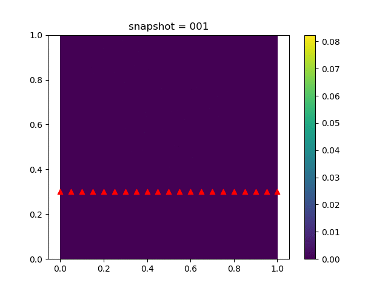
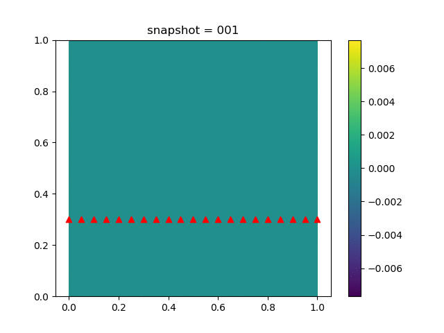
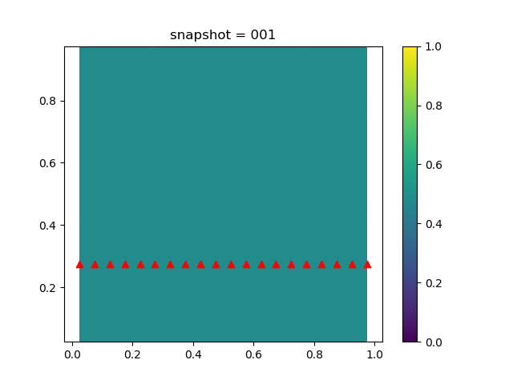

# Inverse Modeling for Poroelasticity Models

We have coupled geomechanics and single phase flow in [`Coupled Geomechanics and Single Phase Flow`](https://kailaix.github.io/PoreFlow.jl/dev/coupled/) (poroelasticity). The governing equation for poroelasticity model is 

$$\begin{aligned}
\mathrm{div}\sigma(u) - b \nabla p &= 0\\
\frac{1}{M} \frac{\partial p}{\partial t} + b\frac{\partial \varepsilon_v(u)}{\partial t} - \nabla\cdot\left(\frac{k}{B_f\mu}\nabla p\right) &= f(x,t)\\
\sigma(u) = H\varepsilon(u)
\end{aligned}$$

We impose no-flow boundary condition for $p$, i.e., $\nabla p \cdot n=0$, a fixed Dirichlet boundary condition for $u$ on the bottom, and traction free boundary conditions for $u$ on all other three sides, i.e., $\sigma(u)n = 0$. We show the data in the following. 

| u displacement              | v displacement              | Pressure                    |
| --------------------------- | --------------------------- | --------------------------- |
|  |  |  |

We estimate the elasticity tensor $H$ by solving a minimization problem 

$$\min_H \sum_{i\in\mathcal{I}} (u^{\mathrm{obs}}_i-u_i)^2$$

where $\mathcal{I}$ is the index set for horizontal displacement  on the top side, $u^{\mathrm{obs}}_i$ is the corresponding observation. [code](https://github.com/kailaix/PoreFlow.jl/blob/master/research/poroelasticity/invpi.jl)

| Initial Guess                                                | Estimated $H$                                                | Reference $H$                                                |
| ------------------------------------------------------------ | ------------------------------------------------------------ | ------------------------------------------------------------ |
| $$\begin{bmatrix}1 &   0 & 0 \\ 0 & 1  & 0 \\ 0    &  0    &  1\\\end{bmatrix}$$ | $$\begin{bmatrix}1.13962  &    0.398865     & -9.63291\times 10^{-6}\\  0.398834   &  1.13959 &       8.32611\times 10^{-5}\\ -1.72994\times 10^{-4} & 1.67993\times 10^{-4}   & 0.740734\end{bmatrix}$$ | $$\begin{bmatrix}1.1396 &   0.39886 & 0.0 \\ 0.39886 & 1.1396  & 0.0 \\ 0.0    &  0.0    &  0.740741\\\end{bmatrix}$$ |

