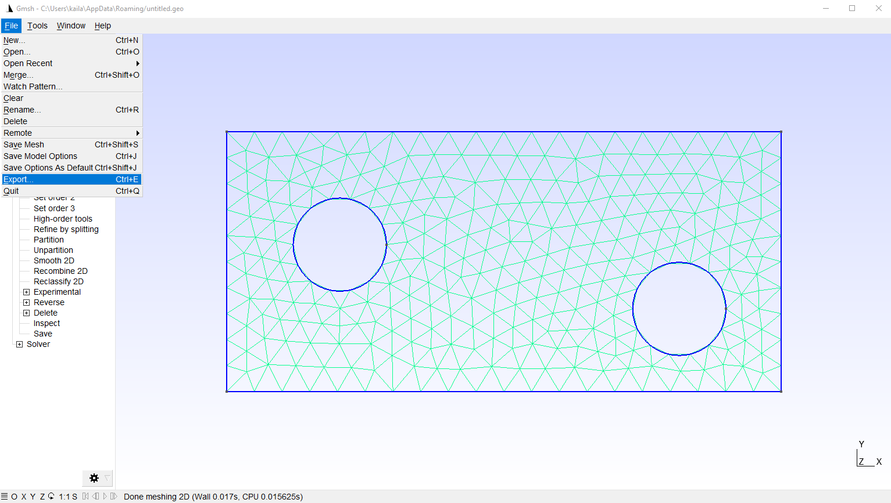
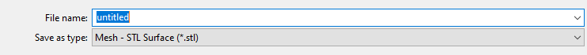

# Construct Unstructured Meshes for PoreFlow

PoreFlow does not have its own mesh generator. This provides users with flexibility to user a third-party mesh generator. In general, users only need to provide the coordinates (`nodes`) and connectivity matrix (`elems`). As mentioned in [this page](https://kailaix.github.io/PoreFlow.jl/dev/tutorial_mfem/), PoreFlow does not use static condensation for tackling boundary conditions; therefore, we do not need to specify the boundary conditions for the mesh. 

The `Mesh` function in PoreFlow can also parse `stl` files. In this article, we show an example how to generate a `stl` data file using [Gmsh](https://gmsh.info/). 

After defining the geometry and generating the mesh in the Gmsh software, we export the mesh in the file menu:



Make sure you save the file as `stl` format



You can read the file (e.g., `example.stl`) into PoreFlow with 

```julia
mesh = Mesh("example.stl")
```

PoreFlow also has some built-in mesh data. They are stored in `PDATA` directory. You can load them directly via

```julia
mesh = Mesh(joinpath(PDATA, "twoholes.stl"))
```