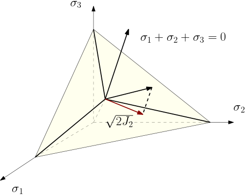
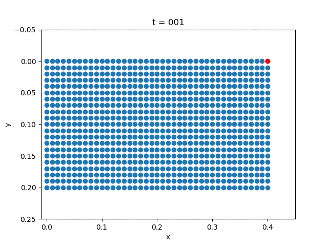
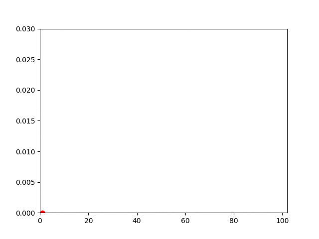

# Plasticity




|            | Displacement Field             | Vertical Displacement           |
| ---------- | ------------------------------ | ------------------------------- |
| Plasticity |  |  |
| Elasticity |  |  |


```julia
using Revise
using PoreFlow
using SparseArrays
using LinearAlgebra
using PyPlot
αm = 0.0
αf = 0.0
β2 = 0.5*(1 - αm + αf)^2
γ = 0.5 - αm + αf

m = 40
n = 20
h = 0.01
NT = 100
Δt = 1/NT 
bdedge = []
for j = 1:n 
    push!(bdedge, [(j-1)*(m+1)+m+1 j*(m+1)+m+1])
end
bdedge = vcat(bdedge...)

bdnode = Int64[]
for j = 1:n+1
    push!(bdnode, (j-1)*(m+1)+1)
end

M = compute_fem_mass_matrix1(m, n, h)
S = spzeros((m+1)*(n+1), (m+1)*(n+1))
M = [M S;S M]
H = diagm(0=>[1,1,0.5])
K = 0.1
σY = 0.03
# σY = 1000.


state = zeros(2(m+1)*(n+1),NT+1)
velo = zeros(2(m+1)*(n+1),NT+1)
acce = zeros(2(m+1)*(n+1),NT+1)
stress = zeros(NT+1, 4*m*n, 3)
internal_variable = zeros(NT+1, 4*m*n)

t = 0.0
for i = 1:NT 
    @info i 
        ##### STEP 1: Computes the external force ####

    T = eval_f_on_boundary_edge((x,y)->0.02*sin(2π*i*Δt), bdedge, m, n, h)
    # T = eval_f_on_boundary_edge((x,y)->0.0, bdedge, m, n, h)
    T = [zeros(length(T)) -T]
    T = compute_fem_traction_term(T, bdedge, m, n, h)
    f1 = eval_f_on_gauss_pts((x,y)->0., m, n, h)
    f2 = eval_f_on_gauss_pts((x,y)->0., m, n, h)
    # f2 = eval_f_on_gauss_pts((x,y)->0.1, m, n, h)
    F = compute_fem_source_term(f1, f2, m, n, h)
    fext = F+T

        ##### STEP 2: Extract Variables ####

    u = state[:,i]
    ∂∂u = acce[:,i]
    ∂u = velo[:,i]

    ε0 = eval_strain_on_gauss_pts(u, m, n, h)
    σ0 = stress[i,:,:]
    α0 = internal_variable[i,:]
    
        ##### STEP 3: Newton Iteration ####

    global t += (1 - αf)*Δt
    ∂∂up = ∂∂u[:]
    iter = 0
    while true
        iter += 1
        # @info iter
        up = (1 - αf)*(u + Δt*∂u + 0.5 * Δt^2 * ((1 - β2)*∂∂u + β2*∂∂up)) + αf*u
        global fint, stiff, α, σ = compute_planestressplasticity_stress_and_stiffness_matrix(
            up, ε0, σ0, α0, K, σY, H, m, n, h
        )
        res = M * (∂∂up *(1 - αm) + αm*∂∂u)  + fint - fext
        A = M*(1 - αm) + (1 - αf) * 0.5 * β2 * Δt^2 * stiff
        A, _ = fem_impose_Dirichlet_boundary_condition(A, bdnode, m, n, h)
        res[[bdnode; bdnode .+ (m+1)*(n+1)]] .= 0.0

        Δ∂∂u = A\res
        ∂∂up -= Δ∂∂u
        err = norm(res)
        # @info err
        if err<1e-8
            break 
        end
    end
    global t += αf*Δt
    
        ##### STEP 3: Update State Variables ####

    u += Δt * ∂u + Δt^2/2 * ((1 - β2) * ∂∂u + β2 * ∂∂up)
    ∂u += Δt * ((1 - γ) * ∂∂u + γ * ∂∂up)
    stress[i+1,:,:] = σ
    internal_variable[i+1,:] = α
    
    state[:,i+1] = u
    acce[:,i+1] = ∂∂up
    velo[:,i+1] = ∂u
end

x = []
y = []
for j= 1:n+1
    for i = 1:m+1
        push!(x, (i-1)*h)
        push!(y, (j-1)*h)
    end
end

for i = 1:5:NT+1
    close("all")
    scatter(x+state[1:(m+1)*(n+1), i], y+state[(m+1)*(n+1)+1:end, i])
    scatter(x[m+1]+state[m+1, i],
            y[m+1]+state[(m+1)*(n+1)+m+1, i], color="red")
    xlabel("x")
    ylabel("y")
    k = string(i)
    k = repeat("0", 3-length(k))*k 
    title("t = $k")
    ylim(-0.05,0.25)
    xlim(-0.01, 0.45)
    gca().invert_yaxis()
    savefig("u$k.png")

    close("all"); 
    plot(1:i, -state[(m+1)*(n+1)+m+1, 1:i])
    xlim(0, NT+2)
    ylim(0, 0.03)
    scatter(i, -state[(m+1)*(n+1)+m+1, i], color="red")
    savefig("du$k.png")
end

run(`convert -delay 10 -loop 0 u*.png plasticity_u.gif`)
run(`convert -delay 10 -loop 0 du*.png plasticity_du.gif`)


```

