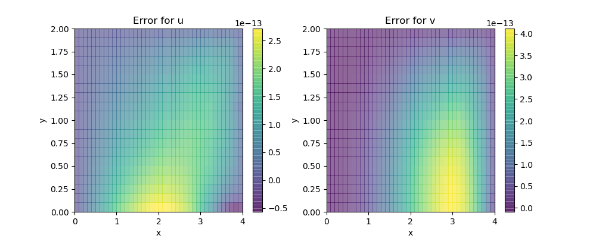

# Static Linear Elasticity

The governing equation for static linear elasticity is

$$\begin{aligned}
\mathrm{div}\ \sigma(u) &= f(x) & x\in \Omega \\
\sigma(u) &= C\varepsilon(u) \\
u(x) &= u_0(x) & x\in \Gamma_u\\
\sigma(x) n(x) &= t(x) & x\in \Gamma_n
\end{aligned}$$

Here $\varepsilon(u) = \frac{1}{2}(\nabla u + (\nabla u)^T)$ is the Cauchy tensor, $\Gamma_u \cup \Gamma_n = \Omega$, $\Gamma_u \cap \Gamma_n = \emptyset$. The weak formulation is: finding $u$ such that 

$$\int_\Omega \delta \varepsilon(u) : C \varepsilon(u)\mathrm{d} x = \int_{\Gamma_n} t\cdot\delta u \mathrm{d}s - \int_\Omega f\cdot \delta u \mathrm{d}x $$

We consider the manufactured solution 

$$u(x) = \begin{bmatrix}
x_1^2+x_2^2\\
x_1^2-x_2^2
\end{bmatrix}$$

and 

$$\begin{bmatrix}
\sigma_{xx}\\
\sigma_{yy}\\
\sigma_{xy}
\end{bmatrix} = \begin{bmatrix}
1 & 0 & 0\\
0 & 1 & 0\\
0 & 0 & 1/2
\end{bmatrix}\begin{bmatrix}
\varepsilon_{xx}\\
\varepsilon_{yy}\\
2\varepsilon_{xy}
\end{bmatrix}$$


then we have 

$$f(x) = \begin{bmatrix}
3\\
-1
\end{bmatrix}$$

We let $\Gamma_n$ be the top boundary. 

```julia
# Setup computational domain 
m = 40; n = 20; h = 0.1
bdedge = []
for i = 1:m 
  push!(bdedge, [i i+1])
end
bdedge = vcat(bdedge...)

bdnode = Int64[]
for j = 1:n+1
  push!(bdnode, (j-1)*(m+1)+1)
  push!(bdnode, (j-1)*(m+1)+m+1)
end
for i = 2:m
  push!(bdnode, n*(m+1)+i)
end

# Compute the source term 
F1 = eval_f_on_gauss_pts((x,y)->3.0, m, n, h)
F2 = eval_f_on_gauss_pts((x,y)->-1.0, m, n, h)
F = compute_fem_source_term(F1, F2, m, n, h)

# Compute the traction term 
t1 = eval_f_on_boundary_edge((x,y)->-x-y, bdedge, m, n, h)
t2 = eval_f_on_boundary_edge((x,y)->2y, bdedge, m, n, h)
T = compute_fem_traction_term([t1 t2], bdedge, m, n, h)

# Compute the stiffness matrix 
D = diagm(0=>[1,1,0.5])
K = compute_fem_stiffness_matrix(D, m, n, h)

# Formulate the right hand side and impose Dirichlet boundary condition
rhs = T - F 
bdval = [eval_f_on_boundary_node((x,y)->x^2+y^2, bdnode, m, n, h);
  eval_f_on_boundary_node((x,y)->x^2-y^2, bdnode, m, n, h)]
rhs[[bdnode;bdnode .+ (m+1)*(n+1)]] = bdval
K, res = fem_impose_Dirichlet_boundary_condition(K, bdnode, m, n, h; bdval = bdval)

# Solve
u = K\(rhs+res)
```

