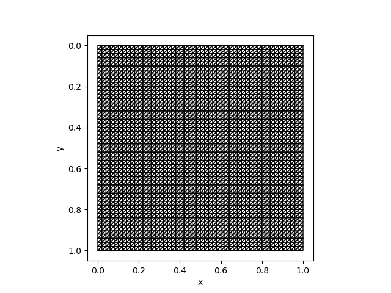
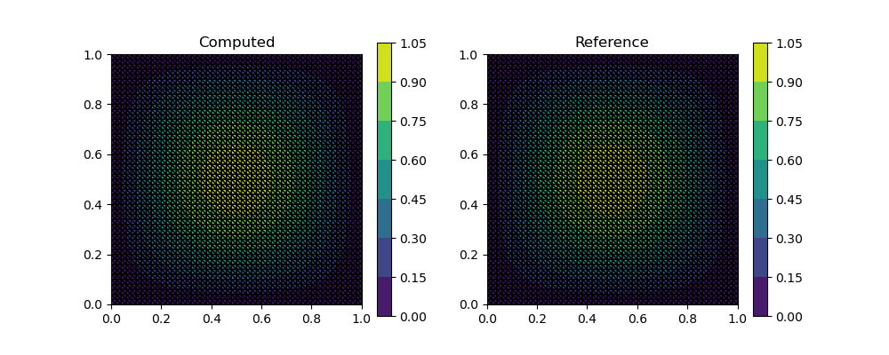

# Unstructured Meshes in PoreFlow

PoreFlow.jl also provides unstructured mesh support by leveraging [MFEM](https://mfem.org/) as the finite element backend. 

The APIs are designed such that they are consistent with structured meshes. For most of the functions, we only need to replace geometry parameters `m, n, h` with `mesh`, which is a [`Mesh`](@ref) instance. The triangular elements are the default in the PoreFlow unstructured mesh module.  `Mesh` can be constructed using a $N\times 2$ node vector and a $E\times 3$ element vector (**1-based**); for example:

```julia
nodes = [0.0 0.0;1.0 0.0;0.0 1.0;1.0 1.0]
elems = [1 2 3;2 3 4]
mesh = Mesh(nodes, elems)
```

Particularly, we provide a convenient constructor for constructing meshes on a rectangle: 

```julia
mesh = Mesh(m, n, h)
visualize_mesh(mesh)
```


Because we do not use the static condensation technique for tackling boundary conditions, there is no need to specify boundary conditions at this point. Plus, the lack of boundary conditions make it easier to develope re-usable custom operators for the finite element method. 

The following script shows how to use an unstructured mesh to solve the Poisson equation [here](https://kailaix.github.io/PoreFlow.jl/dev/gallery/#Poisson's-Equation)

```julia
using PyPlot 
using PoreFlow

m = 50; n = 50; h = 1/n 
mesh = Mesh(m, n, h)
kappa = constant(ones(get_ngauss(mesh)))
A = compute_fem_laplace_matrix1(kappa, mesh)
F = constant(eval_f_on_gauss_pts((x,y)->2π^2*sin(π*x)*sin(π*y), mesh))

bd = Int64[]
for j = 1:m+1
    push!(bd, j)
    push!(bd, n*(m+1)+j)
end
for i = 2:n
    push!(bd, (i-1)*(m+1)+1)
    push!(bd, (i-1)*(m+1)+m+1)
end

A, _ = fem_impose_Dirichlet_boundary_condition1(A, bd, m, n, h)
rhs = compute_fem_source_term1(F, mesh)
rhs = scatter_update(rhs, bd, zeros(length(bd)))
sol = A\rhs

sess = Session(); init(sess)
S = run(sess, sol)

figure(figsize=(10,4))
subplot(121)
visualize_scalar_on_fem_points(S, mesh)
title("Computed")
subplot(122)
visualize_scalar_on_fem_points(eval_f_on_fem_pts((x,y)->sin(π*x)*sin(π*y), mesh), mesh)
title("Reference")
```

