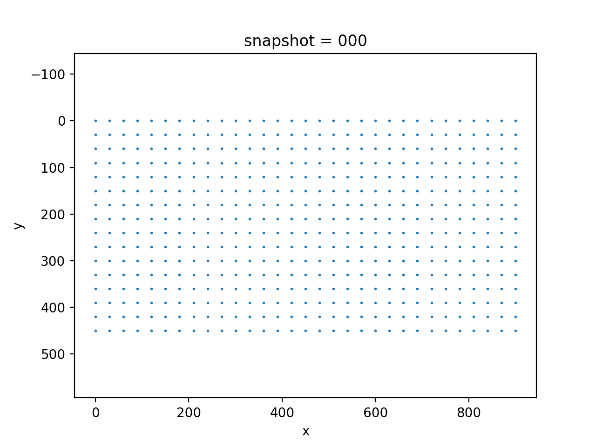
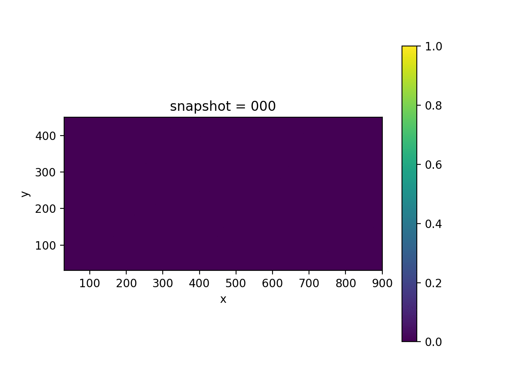
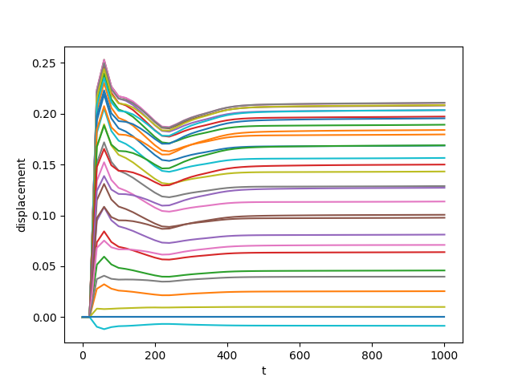
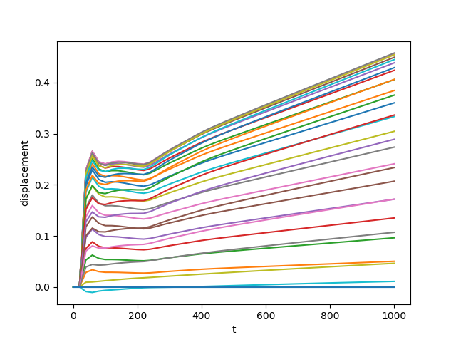

# Coupled Geomechanics and Multiphase Flow

The main focus of this section is to describe the coupled system of geomechanics and multiphase flow equations. 

## Governing Equations

The governing equation of coupled geomechanics and multiphase flow can be described in terms of solid and fluid equations [^geomechanics].

[^geomechanics]: Wan, Jing. *Stabilized finite element methods for coupled geomechanics and multiphase flow*. Diss. stanford university, 2003. 

**Equations for the Solid**

We assume that the solid density is constant, and therefore, *the mass balance equation of the deforming porous medium* is

$$\frac{\partial}{\partial t} (1-\phi) + \nabla\cdot(1-\phi)\mathbf{v}_s = 0 \Leftrightarrow \frac{\partial \phi}{\partial t} + \nabla \cdot (\mathbf{v}_s \phi) = \nabla \cdot \mathbf{v}_s \tag{1}$$

The solid velocity $\mathbf{v}_s$ is given by  

$$\mathbf{v}_s = \frac{d\mathbf{u}}{dt}$$ 

and therefore we have 

$$\nabla \cdot \mathbf{v}_s =\frac{d}{dt} \nabla  \cdot \mathbf{u} = \frac{\partial \varepsilon_{vol}}{\partial t}$$

where the volumetric strain 

$$\varepsilon_{vol} = \nabla \cdot \mathbf{u}$$

It can be shown that Equation 1 leads to the *variation of porosity*:

$$\boxed{\phi = 1-(1-\phi_0)\exp(-\varepsilon_{vol}) } \tag{2}$$

**Equations for the Fluids**

The *mass balance equations of multiphase multicomponent fluid* are given by

$$\frac{\partial }{{\partial t}}(\phi {S_i}{\rho _i}) + \nabla  \cdot ({\rho _i}{\mathbf{v}_{is}}) = {\rho _i}{q_i}, \quad i = 1,2 \tag{3}$$

The *linear momentum balance equation* is given by 

$${\mathbf{v}_{is}} =  - \frac{{K{k_{ri}(S_i)}}}{{{\tilde{\mu}_i}}}(\nabla {P_i} - g{\rho _i}\nabla Z), \quad i=1,2 \tag{4}$$

Here, $K$ is the permeability tensor, but in our case we assume it is a space varying scalar value. $k_{ri}(S_i)$ is a function of $S_i$, and typically the higher the saturation, the easier the corresponding phase is to flow. $\tilde \mu_i$ is the viscosity. $Z$ is the depth cordinate, $\rho_i$ is the density, $\phi$ is the porosity, $q_i$ is the source, $P_i$ is the fluid pressure and $g$ is the velocity constant. We assume the movement of the solid is slow in this study, therefore Darcy’s law is still valid without acceleration terms.

$\mathbf{v}_{is}$ is the relative velocity of the phase $i$ with respect to $\mathbf{v}_s$ (also called *interstitial velocity*). 

**Fluid and Mechanics Coupling**

$$\nabla \cdot {\sigma}' - \nabla \left( S_1P_1 + S_2P_2 \right) + \mathbf{f} = 0\tag{5}$$

Here $\sigma'$ should be understood as the *effective stress*, which allows us to treat a multiphase porous medium as a mechanically equivalent single‐phase continuum. We use the concept of equivalent pressure in (5)

$$P_E = S_1P_1 + S_2P_2 - \int_\Omega (S_1P_1 + S_2P_2) \mathrm{d} x$$

**Constitutive Relation**

The constitutive relation connects $\sigma'$ and the displacement $\mathbf{u}$. For example, the linear elastic relation is expressed as 

$$\sigma' = \lambda \mathbf{I}\nabla \cdot \mathbf{u} + 2\mu \varepsilon \tag{6}$$

Here, the strain is the Cauchy strain

$$\varepsilon = \frac{1}{2}(\nabla \mathbf{u} + (\nabla \mathbf{u})^T)$$

Instead of assuming a linear elasticity model for the geomechanics, we can also model the subsurface solid material by a viscoelasticity model (see [here](https://kailaix.github.io/PoreFlow.jl/dev/viscoelasticity/) for details). For example, the constitutive relation for the two dimensiona Maxwell material is as follows:

$$\dot \sigma_{ij} + \frac{\mu}{\eta} \left( \sigma_{ij} - \frac{\sigma_{kk}}{3}\delta_{ij} \right) = 2\mu \dot \varepsilon_{ij} + \lambda \dot\varepsilon_{kk}\delta_{ij}$$

## Numerical Scheme

We use an iterative algorithm to solve the coupled equation; namely, we alternatively solve the mechanics equation and flow equation. 

**Fluid Equation**

We define the fluid potential 

$$\Psi_i = P_i - \rho_i gZ$$

and the capillary potential 

$$\Psi_c = \Psi_1 - \Psi_2 = P_1 -P_2 - (\rho_1-\rho_2)gZ \approx - (\rho_1-\rho_2)gZ$$

Here the capillary pressure $P_c = P_1-P_2$ is assumed to be small. We define mobilities 

$$m_i(S_i) = \frac{k_{ri}(S_i)}{\tilde\mu_i}, i=1,2\quad m_t = m_1 + m_2$$

We have the following formula from Equations 3-4:

$$-\nabla\cdot (m_tK\nabla \Psi_2) = \nabla \cdot(m_1 K\nabla \Psi_c) - \frac{\partial \phi}{\partial t} + q_1 + q_2 \tag{7}$$

We can solve for $\Psi_2$ using a Poisson solver. 

Next, we have from Equations 3-4

$$\phi\frac{\partial S_2}{\partial t} + S_2 \frac{\partial\phi}{\partial t} + \nabla \cdot (-K m_2 \nabla \Psi_2) = q_2 + q_1 \frac{m_2}{m_1} \tag{8}$$

Note we have an extra term $q_1 \frac{m_2}{m_1}$ to account for the assumption of zero capillary pressure. 

Equation 8 is a nonlinear equation in $S_2$ ($m_2$ is defined in terms of $S_2=1-S_1$) and requires a Newton-Raphson solver. 

**Solid Equation**

Upon solving the fluid equation, we obtain $S_1, S_2, \Psi_2$. We can use $\Psi_2$ to estimate the fluid pressure $P_1$ and $P_2$. Use Equations 5 and 6, we solve for $\mathbf{u}$ using

$$\int_\Omega \sigma' :\delta \varepsilon \mathrm{d} x + \int_\Omega (S_1P_1+S_2P_2)\delta \varepsilon_v \mathrm{d}x = 0 \Leftrightarrow \int_\Omega \sigma' :\delta \varepsilon \mathrm{d} x - \int_\Omega (\Psi_2 + \rho_2 gZ)\delta \varepsilon_v \mathrm{d}x = 0$$

Here $\varepsilon_v = \varepsilon_{xx} + \varepsilon_{yy} = u_x + u_y$. 

## Example

We simulate  the coupled geomechanics  (both the linear elastic and the viscoelastic material) and two phase flow model. The two models share the same Lamé constants $\lambda$ and $\mu$ (or equivalently, $E$ and $\nu$), except that the viscoelasticity model has one more viscosity parameter $\eta$. We show an animation of the von Mises stress, displacement (magnified by 50x), the fluid potential for the wet phase ($\Psi_2$), and the saturation. Particularly, we plot the $x$-direction displacements on the surface. The displacement data will be used as observation in the inverse problem. 

The setting is as follows: we consider a layer model for the relative permeability $K$ (the values of the space varying $K$ are known). The blue triangle denotes the injection well, and the orange triangle denotes the production well. The blue triangles denote receivers, where we can collect horizontal displacement---for example, we can obtain these data from satellite images. 

The two flow phases are the oil and the water (the wet phase), and we use number 1 and 2 to denote them respectively. The computational domain is has 450 depth and 900 width, and it is discretized into $15\times 30$ uniform squares for both the finite element method (for the mechanics equation) and the finite volume method (for the fluid equation). The simulation has time horizon $[0,1000]$ and is temporally discretized into 50 intervals. The other parameters for simulations are: $\rho_1=1053$, $\rho_2=501.9$, $\tilde\mu_1=1$, $\tilde\mu_2=0.1$, $g =9.8$. In the linear elasticity case, we use $E=6\times 10^9$ and $\nu=0.35$. In the viscoelasticity case, in addition to the Lamé constants, the viscosity parameter $\eta=6.7\times 10^{11}$. 

| Model                                   | Linear Elasticity                                            | Viscoelasticity                                              |
| --------------------------------------- | ------------------------------------------------------------ | ------------------------------------------------------------ |
| Displacement $u$                        |  |  |
| Saturation $S_2$                        |  |  |
| Potential $\Psi_2$                      |  |  |
| Pressure $p$                            |  |  |
| Von Mises Stress $\sigma_{\mathrm{vm}}$ |  |  |
| Observation $u_{\mathrm{obs}}$          |  |  |

