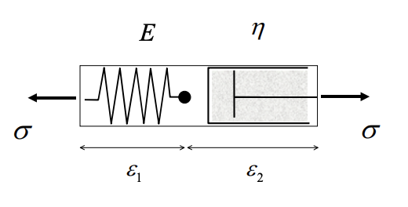
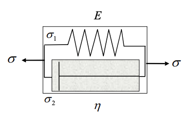
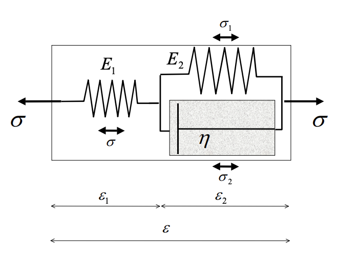

#  Viscoelasticity


## Viscoelasticity Theory

To describe the viscoelasticity, we need to relate both the viscosity strain $\varepsilon^{vp}$ and the elasticity strain $\varepsilon^e$ to the stress $\sigma$. The latter is given by 

$$\boxed{\varepsilon^e= \frac{\sigma}{E}} $$

The constitutive relation of $\varepsilon^{vp}$ is given by 

$$\boxed{\dot \varepsilon^{vp} = \frac{\sigma}{\eta}}$$

We can consider the elasticity strain associated with a spring while the viscoelasticity associated with a dashed pot. Then based on how we combine the spring or the dashed pot, we can have many cases [^linearvisco]

[^linearvisco]: https://academic.csuohio.edu/duffy_s/Linear_Visco.pdf

| Maxwell Model                                                | Kevin Model                                                  | Standard Linear Model                                        |
| ------------------------------------------------------------ | ------------------------------------------------------------ | ------------------------------------------------------------ |
|                |              |               |
| $$\begin{aligned}\varepsilon &= \varepsilon_1 + \varepsilon_2\\\varepsilon_1 &= \frac{\sigma}{E}\\\dot\varepsilon_2 &= \frac{\sigma}{\eta}\end{aligned}$$ | $$\begin{aligned}\sigma &= \sigma_1 + \sigma_2\\\varepsilon_1 &= \frac{\sigma}{E}\\\dot\varepsilon_2 &= \frac{\sigma}{\eta}\end{aligned}$$ | $$\begin{aligned}\sigma &= \sigma_1 + \sigma_2\\\varepsilon &= \varepsilon_1 + \varepsilon_2\\\sigma &= E_1 \varepsilon_1\\\sigma_1 &= E_2\varepsilon_2\\\sigma_2 &= \eta\dot\varepsilon_2\\\end{aligned}$$ |


The most general constitutive equation has the following form 

```math
p_0\sigma + p_1\dot\sigma + p_2\ddot \sigma + p_3 \dddot \sigma + \cdots = q_0\varepsilon + q_1\dot\varepsilon + q_2\ddot \varepsilon + q_3 \dddot \varepsilon + \cdots
```

For high dimensional case, assume that the bulk modulus is $K$, then we have [^linearvisco2]

[^linearvisco2]: http://solidmechanics.org/text/Chapter3_6/Chapter3_6.htm

```math
\begin{aligned}& e_{ij} = \varepsilon_{ij} - \varepsilon_{kk} \delta_{ij} \qquad \sigma_{ij} = s_{ij} + K\varepsilon_{kk}\delta_{ij}\\
& ks_{ij} + \eta \dot s_{ij} = k\eta\dot e_{ij} && \mathrm{Maxwell}\\
& s_{ij} = ke_{ij} + \eta \dot e_{ij} && \mathrm{Kevin}\\
& k_1s_{ij} + \eta\dot s_{ij} = k_1k_2e_{ij} + (k_1+k_2) \eta\dot e_{ij} && \mathrm{Standard}\ \mathrm{Linear}
\end{aligned}
```


## Numerical Example

