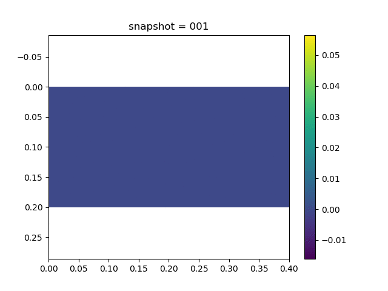
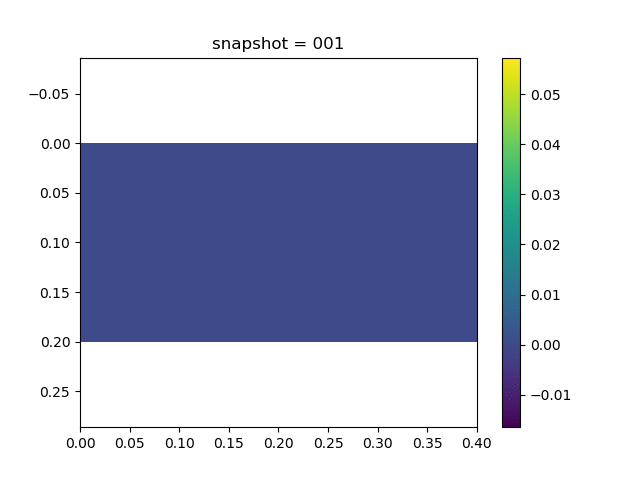
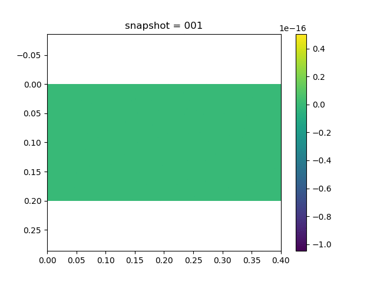
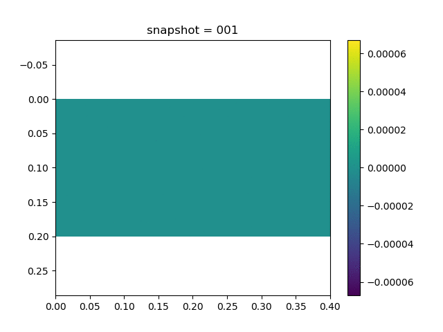
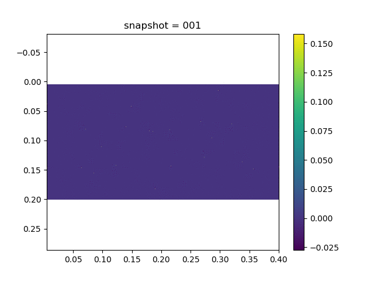
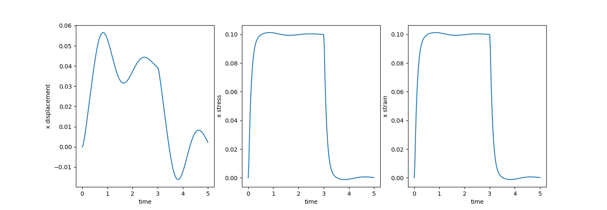
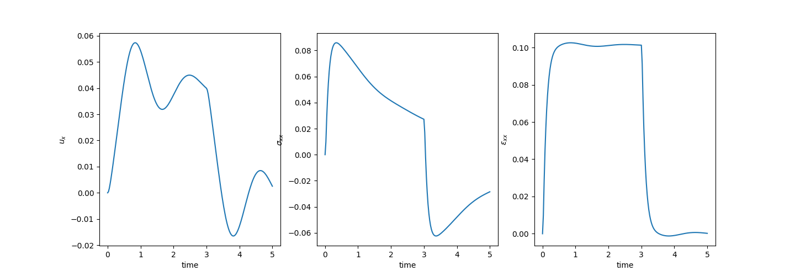

#  Viscoelasticity


## Viscoelasticity Theory

To describe the viscoelasticity, we need to relate both the viscosity strain $\epsilon^{vp}$ and the elasticity strain $\epsilon^e$ to the stress $\sigma$. The latter is given by 

$$\boxed{\epsilon^e= \frac{\sigma}{E}}$$

The constitutive relation of $\epsilon^{vp}$ is given by 

$$\boxed{\dot \epsilon^{vp} = \frac{\sigma}{\eta}}$$

We can consider the elasticity strain associated with a spring while the viscoelasticity associated with a dashed pot. Then based on how we combine the spring or the dashed pot, we can have many cases [^linearvisco]

[^linearvisco]: https://academic.csuohio.edu/duffy_s/Linear_Visco.pdf

| Maxwell Model                                                | Kevin Model                                                  | Standard Linear Model                                        |
| ------------------------------------------------------------ | ------------------------------------------------------------ | ------------------------------------------------------------ |
|                |              |               |
| $$\begin{aligned}\epsilon &= \epsilon_1 + \epsilon_2\\\epsilon_1 &= \frac{\sigma}{E}\\\dot\epsilon_2 &= \frac{\sigma}{\eta}\end{aligned}$$ | $$\begin{aligned}\sigma &= \sigma_1 + \sigma_2\\\epsilon_1 &= \frac{\sigma}{E}\\\dot\epsilon_2 &= \frac{\sigma}{\eta}\end{aligned}$$ | $$\begin{aligned}\sigma &= \sigma_1 + \sigma_2\\\epsilon &= \epsilon_1 + \epsilon_2\\\sigma &= E_1 \epsilon_1\\\sigma_1 &= E_2\epsilon_2\\\sigma_2 &= \eta\dot\epsilon_2\\\end{aligned}$$ |


The most general constitutive equation has the following form 

```math
p_0\sigma + p_1\sigma' + p_2 \sigma'' + p_3  \sigma''' + \cdots = q_0\epsilon + q_1\epsilon' + q_2 \epsilon'' + q_3  \epsilon''' + \cdots
```

For high dimensional case, assume that the bulk modulus is $K$, then we have [^linearvisco2]

[^linearvisco2]: http://solidmechanics.org/text/Chapter3_6/Chapter3_6.htm

```math
\begin{aligned}& e_{ij} = \epsilon_{ij} - \epsilon_{kk} \delta_{ij} \qquad \sigma_{ij} = s_{ij} + K\epsilon_{kk}\delta_{ij}\\
& ks_{ij} + \eta \dot s_{ij} = k\eta\dot e_{ij} && \mathrm{Maxwell}\\
& s_{ij} = ke_{ij} + \eta \dot e_{ij} && \mathrm{Kevin}\\
& k_1s_{ij} + \eta\dot s_{ij} = k_1k_2e_{ij} + (k_1+k_2) \eta\dot e_{ij} && \mathrm{Standard}\ \mathrm{Linear}
\end{aligned}
```


## Numerical Example

We consider the two dimensional Maxwell material

$$\dot \sigma_{ij} + \frac{\mu}{\eta} \left( \sigma_{ij} - \frac{\sigma_{kk}}{3}\delta_{ij} \right) = 2\mu \dot \epsilon_{ij} + \lambda \dot\epsilon_{kk}\delta_{ij}\tag{1}$$

along with the balance of linear momentum equation

$$\mathrm{div}\ \sigma_{ij,j} + \rho f_i = \rho \ddot u_i$$


In the matrix format, the constitutive relation has the form

$$\begin{bmatrix}
\dot\sigma_{xx}\\ 
\dot\sigma_{yy}\\ 
\dot\sigma_{xy}
\end{bmatrix} + \frac{\mu}{\eta}\begin{bmatrix}
2/3 & 1/3 & 0 \\ 
1/3 & 2/3 & 0 \\ 
0 & 0 & 1 
\end{bmatrix}\begin{bmatrix}
\sigma_{xx}\\ 
\sigma_{yy}\\ 
\sigma_{xy}\end{bmatrix} = 
\begin{bmatrix}
2\mu + \lambda & \lambda & 0 \\ 
\lambda & 2\mu + \lambda & 0 \\ 
0 & 0 & \mu 
\end{bmatrix}\begin{bmatrix}
\dot\epsilon_{xx}\\ 
\dot\epsilon_{yy}\\ 
\dot\gamma_{xy}
\end{bmatrix}$$

Here $\gamma_{xy}=2\epsilon_{xy}$, where $\epsilon_{xy}$ is the shear modulus. Note that when $\eta=\infty$, this constitutive relation is exactly the plain strain linear elasticity.  


We use the implicit discretization for Eq. (1) 


$$\begin{bmatrix}
1 + \frac{2}{3}\frac{\mu\Delta t}{\eta} & -\frac{1}{3}\frac{\mu\Delta t}{\eta} & 0\\
-\frac{1}{3}\frac{\mu\Delta t}{\eta} & 1 + \frac{2}{3}\frac{\mu\Delta t}{\eta} & 0 \\
0 & 0 & 1 + \frac{\mu\Delta t}{\eta}
\end{bmatrix}
\begin{bmatrix}
	\sigma_{xx}^{n+1}\\
	\sigma_{yy}^{n+1}\\
	\sigma_{xy}^{n+1}
\end{bmatrix} = \begin{bmatrix}
	\sigma_{xx}^{n}\\
	\sigma_{yy}^{n}\\
	\sigma_{xy}^{n}
\end{bmatrix}  + \begin{bmatrix}
	2\mu+\lambda & \lambda & 0\\
	\lambda & 2\mu+\lambda & 0\\
	0 & 0 & \mu 
\end{bmatrix}\left(\begin{bmatrix}
	\epsilon_{xx}^{n+1}\\
	\epsilon_{yy}^{n+1}\\
	\gamma_{xy}^{n+1}
\end{bmatrix}-\begin{bmatrix}
	\epsilon_{xx}^{n}\\
	\epsilon_{yy}^{n}\\
	\gamma_{xy}^{n}
\end{bmatrix}\right)$$


or in a simpler form

$$\sigma^{n+1} = H \epsilon^{n+1} + S \sigma^n  - H\epsilon^n$$

Here $S$ and $H$ are defined as 

$$S = \begin{bmatrix}
1 + \frac{2}{3}\frac{\mu\Delta t}{\eta} & -\frac{1}{3}\frac{\mu\Delta t}{\eta} & 0\\
-\frac{1}{3}\frac{\mu\Delta t}{\eta} & 1 + \frac{2}{3}\frac{\mu\Delta t}{\eta} & 0 \\
0 & 0 & 1 + \frac{\mu\Delta t}{\eta}
\end{bmatrix}^{-1}$$

$$H = S\begin{bmatrix}
	2\mu+\lambda & \lambda & 0\\
	\lambda & 2\mu+\lambda & 0\\
	0 & 0 & \mu 
\end{bmatrix}$$

The parameters used in the simulation are

| $\lambda$ | $\mu$ | $\eta$ | $\Delta t$ and $T$ | Domain and $h$                   |
| --------- | ----- | ------ | ------------------ | -------------------------------- |
| 0.0       | 0.5   | 1.0    | 0.025 and 5.0      | $[0,0.2]\times [0,0.4]$ and 0.01 |

| Description                      | Linear Elasticity                                            | Viscoelasticity                                              |
| -------------------------------- | ------------------------------------------------------------ | ------------------------------------------------------------ |
| $x$ displacement                 |  |  |
| $y$ displacement                 |  |  |
| Von Mises Stress                 |  |  |
| Statistics of Middle Right point |  |  |


**Simulation Code**


* Linear Elasticity

```julia
using Revise
using PoreFlow
using PyCall
using LinearAlgebra
using PyPlot
using SparseArrays
np = pyimport("numpy")

β = 1/4; γ = 1/2
a = b = 0.1
m = 40
n = 20
h = 0.01
NT = 200
Δt = 5/NT 
bdedge = []
for j = 1:n 
  push!(bdedge, [(j-1)*(m+1)+m+1 j*(m+1)+m+1])
end
bdedge = vcat(bdedge...)

bdnode = Int64[]
for j = 1:n+1
  push!(bdnode, (j-1)*(m+1)+1)
end

M = compute_fem_mass_matrix1(m, n, h)
S = spzeros((m+1)*(n+1), (m+1)*(n+1))
M = [M S;S M]

H = [1.0 0.0 0.0
    0.0 1.0 0.0
    0.0 0.0 0.5]
K = compute_fem_stiffness_matrix(H, m, n, h)
C = a*M + b*K # damping matrix 

L = M + γ*Δt*C + β*Δt^2*K
L, Lbd = fem_impose_Dirichlet_boundary_condition(L, bdnode, m, n, h)

a = zeros(2(m+1)*(n+1))
v = zeros(2(m+1)*(n+1))
d = zeros(2(m+1)*(n+1))
U = zeros(2(m+1)*(n+1),NT+1)

Sigma = zeros(NT+1, 4m*n, 3)
Varepsilon = zeros(NT+1, 4m*n, 3)
for i = 1:NT 
    global a, v, d
    T = eval_f_on_boundary_edge((x,y)->0.1, bdedge, m, n, h)
    T = [T zeros(length(T))]
    rhs = compute_fem_traction_term(T, bdedge, m, n, h)
    if i*Δt>3.0
      rhs = zero(rhs)
    end

    td = d + Δt*v + Δt^2/2*(1-2β)*a 
    tv = v + (1-γ)*Δt*a 
    rhs = rhs - C*tv - K*td
    rhs[[bdnode; bdnode.+(m+1)*(n+1)]] .= 0.0

    a = L\rhs 
    d = td + β*Δt^2*a 
    v = tv + γ*Δt*a 
    U[:,i+1] = d


    Varepsilon[i+1,:,:] = eval_strain_on_gauss_pts(U[:,i+1], m, n, h)
    Sigma[i+1,:,:] = Varepsilon[i+1,:,:] * H
end


visualize_scattered_displacement(U, m, n, h; name = "_linear", xlim_=[-0.01,0.5], ylim_=[-0.05,0.22])
visualize_displacement(U, m, n, h;  name = "_linear")
visualize_stress(H, U, m, n, h;  name = "_linear")


close("all")
figure(figsize=(15,5))
subplot(1,3,1)
idx = div(n,2)*(m+1) + m+1
plot((0:NT)*Δt, U[idx,:])
xlabel("time")
ylabel("x displacement")

subplot(1,3,2)
idx = 4*(div(n,2)*m + m)
plot((0:NT)*Δt, Sigma[:,idx,1])
xlabel("time")
ylabel("x stress")

subplot(1,3,3)
idx = 4*(div(n,2)*m + m)
plot((0:NT)*Δt, Varepsilon[:,idx,1])
xlabel("time")
ylabel("x strain")
savefig("linear.png")
```


* Viscoelasticity

```julia
using Revise
using PoreFlow
using PyCall
using LinearAlgebra
using PyPlot
using SparseArrays
np = pyimport("numpy")

λ = 0.0
μ = 0.5
η = 1.0

β = 1/4; γ = 1/2
a = b = 0.1
m = 40
n = 20
h = 0.01
NT = 200
Δt = 5/NT 
bdedge = []
for j = 1:n 
  push!(bdedge, [(j-1)*(m+1)+m+1 j*(m+1)+m+1])
end
bdedge = vcat(bdedge...)

bdnode = Int64[]
for j = 1:n+1
  push!(bdnode, (j-1)*(m+1)+1)
end

G = [1/Δt+μ/η -μ/3η 0.0
  -μ/3η 1/Δt+μ/η-μ/3η 0.0
  0.0 0.0 1/Δt+μ/η]
S = [2μ/Δt+λ/Δt λ/Δt 0.0
    λ/Δt 2μ/Δt+λ/Δt 0.0
    0.0 0.0 μ/Δt]
invG = inv(G)
H = invG*S

M = compute_fem_mass_matrix1(m, n, h)
Zero = spzeros((m+1)*(n+1), (m+1)*(n+1))
M = [M Zero;Zero M]

K = compute_fem_stiffness_matrix(H, m, n, h)
C = a*M + b*K # damping matrix 

L = M + γ*Δt*C + β*Δt^2*K
L, Lbd = fem_impose_Dirichlet_boundary_condition(L, bdnode, m, n, h)

a = zeros(2(m+1)*(n+1))
v = zeros(2(m+1)*(n+1))
d = zeros(2(m+1)*(n+1))
U = zeros(2(m+1)*(n+1),NT+1)
Sigma = zeros(NT+1, 4m*n, 3)
Varepsilon = zeros(NT+1, 4m*n, 3)
for i = 1:NT 
    global a, v, d
    T = eval_f_on_boundary_edge((x,y)->0.1, bdedge, m, n, h)
    T = [T zeros(length(T))]
    rhs = compute_fem_traction_term(T, bdedge, m, n, h)

    if i*Δt>3.0
      rhs = zero(rhs)
    end

    F = compute_strain_energy_term(Sigma[i,:,:]*invG/Δt, m, n, h) - K * U[:,i]
    # @show norm(compute_strain_energy_term(Sigma[i,:,:]*invG/Δt, m, n, h)), norm(K * U[:,i])
    rhs -= Δt^2 * F

    td = d + Δt*v + Δt^2/2*(1-2β)*a 
    tv = v + (1-γ)*Δt*a 
    rhs = rhs - C*tv - K*td
    rhs[[bdnode; bdnode.+(m+1)*(n+1)]] .= 0.0

    a = L\rhs 
    d = td + β*Δt^2*a 
    v = tv + γ*Δt*a 
    U[:,i+1] = d

    Varepsilon[i+1,:,:] = eval_strain_on_gauss_pts(U[:,i+1], m, n, h)
    Sigma[i+1,:,:] = Sigma[i,:,:]*invG/Δt +  (Varepsilon[i+1,:,:]-Varepsilon[i,:,:])*(invG*S)
end


visualize_scattered_displacement(U, m, n, h; name = "_viscoelasticity", xlim_=[-0.01,0.5], ylim_=[-0.05,0.22])
visualize_displacement(U, m, n, h;  name = "_viscoelasticity")
visualize_stress(H, U, m, n, h;  name = "_viscoelasticity")

close("all")
figure(figsize=(15,5))
subplot(1,3,1)
idx = div(n,2)*(m+1) + m+1
plot((0:NT)*Δt, U[idx,:])
xlabel("time")
ylabel("\$u_x\$")

subplot(1,3,2)
idx = 4*(div(n,2)*m + m)
plot((0:NT)*Δt, Sigma[:,idx,1])
xlabel("time")
ylabel("\$\\sigma_{xx}\$")

subplot(1,3,3)
idx = 4*(div(n,2)*m + m)
plot((0:NT)*Δt, Varepsilon[:,idx,1])
xlabel("time")
ylabel("\$\\epsilon_{xx}\$")
savefig("visco.png")

```

