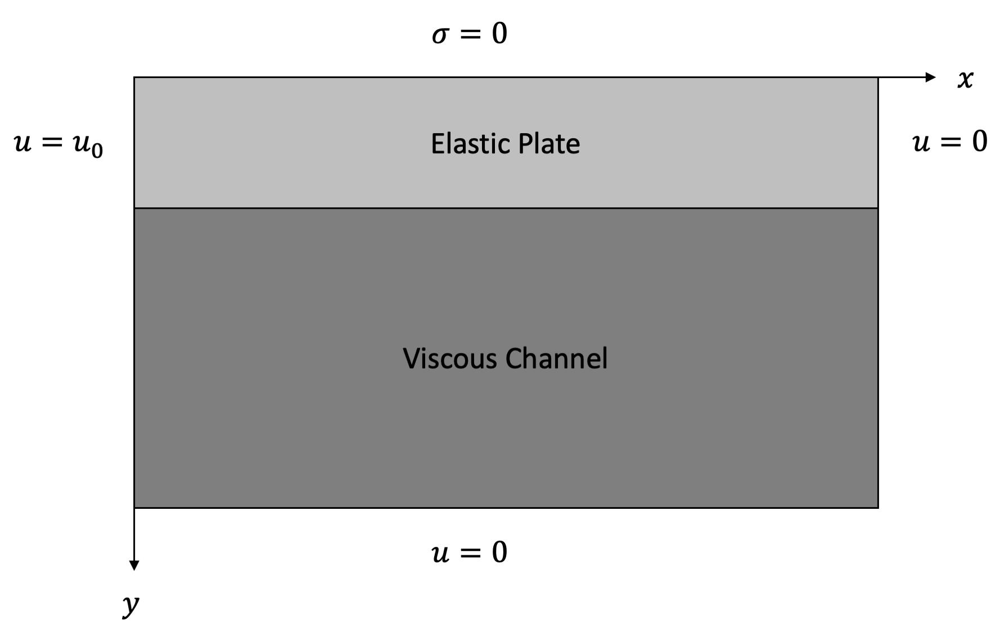
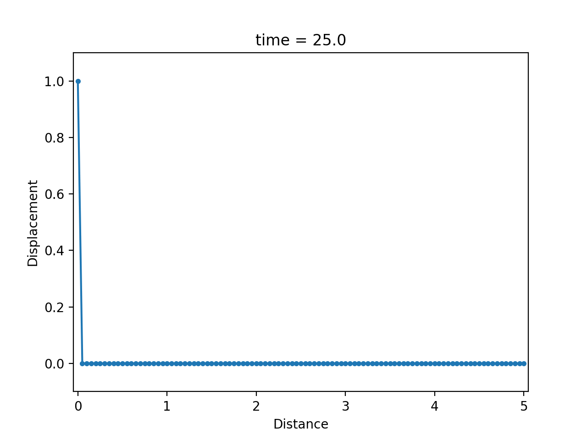
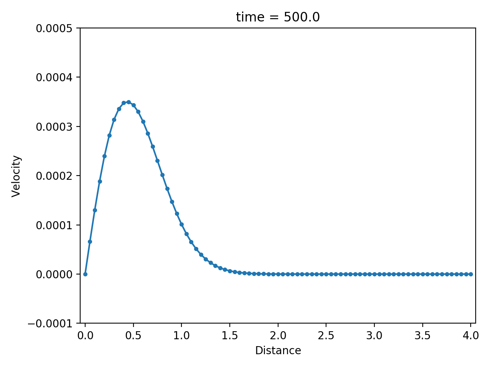
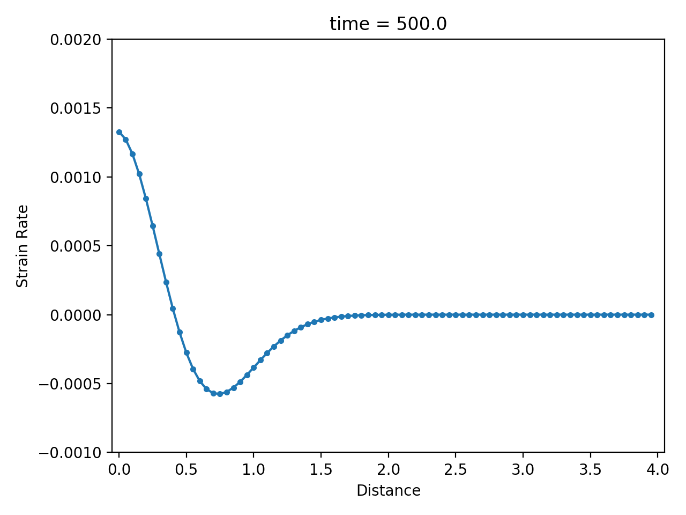

# Antiplane Viscoelasticity

In a [previous section](https://kailaix.github.io/PoreFlow.jl/dev/viscoelasticity/), we consider the viscoelasticity constitutive relation. In this section, we consider a very important special case: antiplane viscoelasticity. In this case, the displacement only occurs in the $z$ direction, so we can use a scalar valued function $u(x,y)$ to denote the displacement. 

The constitutive relation is (kinetics equation)

$$\begin{aligned}\dot \sigma_{31} + \frac{\mu}{\eta} \sigma_{31} &= 2\mu\dot\epsilon_{31}\\ \dot \sigma_{32} + \frac{\mu}{\eta} \sigma_{32} &= 2\mu\dot\epsilon_{32}\end{aligned}$$

Here

$$\epsilon_{31} = \frac{\partial u}{\partial x},\quad \epsilon_{32} = \frac{\partial u}{\partial y}$$

To complete the equation, we also have the balance of linear momentum (kinematic equation)

$$\sigma_{31,1} + \sigma_{32,2} + f = \rho \ddot u \tag{1}$$

where $f$ is the body force and $\rho$ is the density. 

!!! note 
    In the case $\eta$ is very small, the constitutive relation can be approximated by  

    $$\sigma_{31} = 2\eta \dot\epsilon_{31},\quad \sigma_{32} = 2\eta \dot\epsilon_{32}$$
    
    By plugging the equations into Equation 1 (ignoring the body force), and integrate  in time
    
    $$2\eta (\epsilon_{31,1} + \epsilon_{32,2})  = \rho \dot u \Rightarrow 2\eta \Delta u = \rho \dot u \tag{2}$$
    
    Equation 2 is a **diffusion equation**. 

!!! note
    In the case $\eta$ is very large, the constitutive relation is reduced to linear elasticity

    $$\sigma = 2\mu\epsilon$$
    
    Therefore, the kinematic equation is reduced to a **wave equation**
    
    $$2\mu \Delta u = \ddot u$$
    
    We discretize the constitutive relation using an implicit scheme
    
    $$\frac{\sigma^{n+1} - \sigma^n}{\Delta t} + \frac{\mu}{\eta}\sigma^{n+1} = 2\mu \frac{\epsilon^{n+1}-\epsilon^n}{\Delta t}$$
    
    which is equivalent to 
    
    $$\sigma^{n+1} = \frac{2\mu\eta}{\eta + \mu\Delta t}\epsilon^{n+1}- \frac{2\mu\eta}{\eta + \mu\Delta t}\epsilon^{n} + \frac{\eta}{\eta+\mu\Delta t}\sigma^n$$

## Numerical example

|displacement $u$                                 |velocity $\dot u$                              | strain rate   $\partial \dot u / \partial x$     |
|:------------------------------------------------|:----------------------------------------------|:-------------------------------------------------|
|   |    |      |
