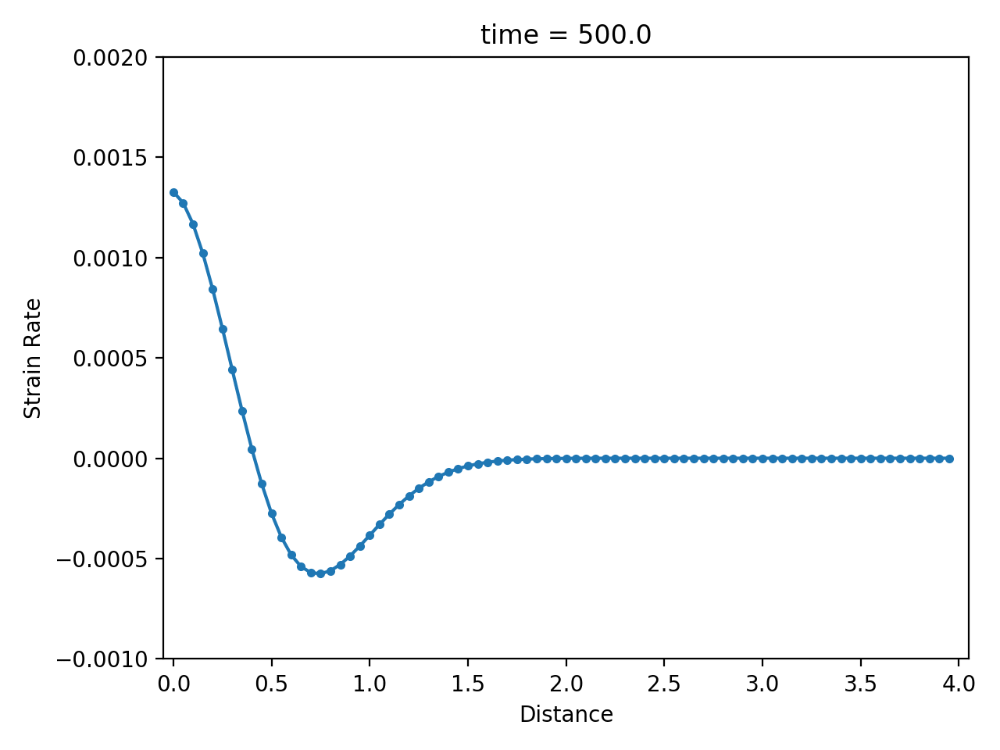
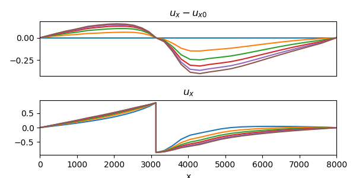
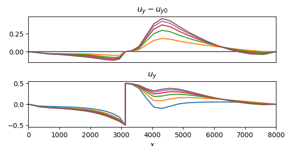
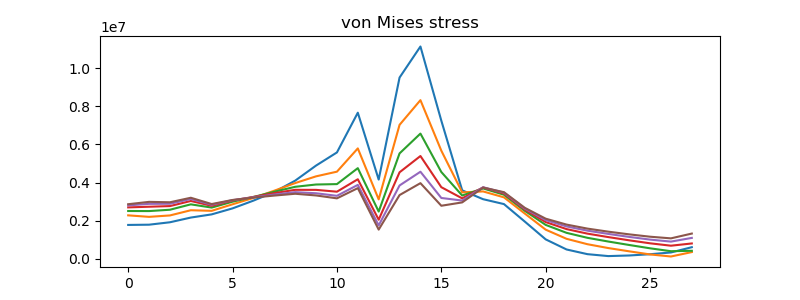

# Viscoelasticity of the Earth

In a [previous section](https://kailaix.github.io/PoreFlow.jl/dev/viscoelasticity/), we consider the viscoelasticity constitutive relation. In this section, we consider an application case: the viscoelasticity of the Earth. We show the viscoelasticity effect related with postseismic relaxation under two settings: strike-slip fault and dip-slip fault. The background of these problems can be found in Chapter 6 of Segall, P. (2010)'s book *"[Earthquake and volcano deformation](https://press.princeton.edu/books/hardcover/9780691133027/earthquake-and-volcano-deformation)"*.


In geology, a [fault](https://en.wikipedia.org/wiki/Fault_(geology)) is a planar fracture or discontinuity in a volume of rock across which there has been significant displacement as a result of rock-mass movement. There are many types of faults based on the direction of slip. In this section, we focus on two types of slip: **strike-slip**, where the offset is predominantly horizontal, and **dip-slip**, where offset is predominately vertical. 


```@raw html
<center>

</center>
```

We use a viscoelasticity model to describe the fault evolution. The mathematical equations are discretized on an unstructure quadrilateral mesh using the finite element method. We estimate the viscoelasticity parameter from surface displacement data using a gradient-based optimization (L-BFGS-B) technique.  We utilize the AD-capable [`ViscoelasticitySolver`](@ref) in [NNFEM](https://github.com/kailaix/NNFEM.jl/) for forward computational and automatic differentiation. 

## Strike-slip Fault Setting

In this case, the displacement only occurs in the $z$ direction, so we can use a scalar valued function $u(x,y)$ to denote the displacement. 

```@raw html
<center>

</center>
```

The constitutive relation is described by the Maxwell viscoelasticity model

$$\begin{aligned}\dot \sigma_{31} + \frac{\mu}{\eta} \sigma_{31} &= 2\mu\dot\epsilon_{31}\\ \dot \sigma_{32} + \frac{\mu}{\eta} \sigma_{32} &= 2\mu\dot\epsilon_{32}\end{aligned}$$

Here

$$\epsilon_{31} = \frac{\partial u}{\partial x},\quad \epsilon_{32} = \frac{\partial u}{\partial y}$$

To complete the equation, we also have the balance of linear momentum (kinematic equation)

$$\sigma_{31,1} + \sigma_{32,2} + f = \rho \ddot u$$

where $f$ is the body force and $\rho$ is the density. 

!!! note
    In the case $\eta$ is very small, the constitutive relation can be approximated by  

    $$\sigma_{31} = 2\eta \dot\epsilon_{31},\quad \sigma_{32} = 2\eta \dot\epsilon_{32}$$
    
    By plugging the equations into Equation 1 (ignoring the body force), and integrate  in time
    
    $$2\eta (\epsilon_{31,1} + \epsilon_{32,2})  = \rho \dot u \Rightarrow 2\eta \Delta u = \rho \dot u \tag{1}$$
    
    Equation 1 is a **diffusion equation**. 

!!! note
    In the case $\eta$ is very large, the constitutive relation is reduced to linear elasticity

    $$\sigma = 2\mu\epsilon$$
    
    Therefore, the kinematic equation is reduced to a **wave equation**
    
    $$2\mu \Delta u = \ddot u$$
    
    We discretize the constitutive relation using an implicit scheme
    
    $$\frac{\sigma^{n+1} - \sigma^n}{\Delta t} + \frac{\mu}{\eta}\sigma^{n+1} = 2\mu \frac{\epsilon^{n+1}-\epsilon^n}{\Delta t}$$
    
    which is equivalent to 
    
    $$\sigma^{n+1} = \frac{2\mu\eta}{\eta + \mu\Delta t}\epsilon^{n+1}- \frac{2\mu\eta}{\eta + \mu\Delta t}\epsilon^{n} + \frac{\eta}{\eta+\mu\Delta t}\sigma^n$$


### Numerical example

|displacement $u$                                 |velocity $\dot u$                              | strain rate   $\partial \dot u / \partial x$     |
|:------------------------------------------------|:----------------------------------------------|:-------------------------------------------------|
|   |    |      |

## Dip-slip Fault Setting

The constitutive relation of a dip-slip fault can be described by a plane strain viscoelasticity model


```@raw html
<center>

</center>
```

|horizontal slip $u_x$                                 |vertical slip $u_y$                               | von Mises stress     |
|:------------------------------------------------|:----------------------------------------------|:-------------------------------------------------|
|   |    |     |

```@raw html
<center>

</center>
```


Example code: [dippingfault_viscosity_forward.jl](https://github.com/kailaix/PoreFlow.jl/blob/master/earthquake/unstructured/dippingfault_viscosity_forward.jl), [dippingfault_viscosity_inversion.jl](https://github.com/kailaix/PoreFlow.jl/blob/master/earthquake/unstructured/dippingfault_viscosity_inversion.jl).